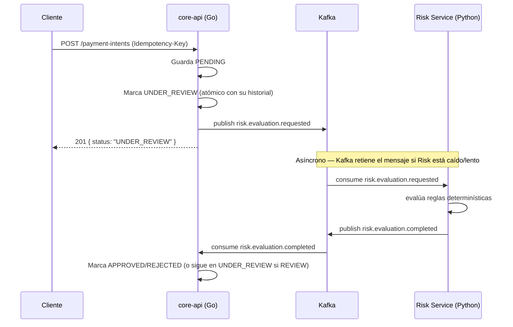

# MOVA Payment Orchestrator

Vertical de procesamiento de pagos para comercios: Payment Intents con
evaluación de riesgo asíncrona, trazabilidad completa, e idempotencia
respaldada por base de datos. Trabajo en equipo — ver
[Matriz de contribuciones](#matriz-de-contribuciones) para quién hizo qué.

## Arquitectura

| Componente | Tecnología | Responsabilidad | Estado |
|---|---|---|---|
| `core-api` | Go | Payment Intents, estados, idempotencia, API HTTP | En este PR |
| `risk-service` | Python | Evaluación de riesgo, reglas determinísticas | Pendiente (Sergio) |
| `reconciliation-worker` | Python | Expira Payment Intents vencidos | Pendiente (Sergio) |
| PostgreSQL | Infra | Fuente de verdad — hoy en memoria (ver [Pendientes](#pendientes)) | Pendiente (Eduard) |
| Redis | Infra | Lock rápido de idempotencia — hoy un no-op (ver [Pendientes](#pendientes)) | Pendiente (Eduard) |
| Kafka | Infra | Mensajería `core-api` ↔ `risk-service` | Funcionando |

**Límite no negociable:** ningún servicio Python escribe directo en las
tablas del core — todo pasa por eventos de Kafka o por la API pública de
`core-api`.

### Flujo



Ver [ADR-0001](docs/adr/0001-contrato-go-python.md) para el contrato
exacto de los eventos, y [ADR-0003](docs/adr/0003-politica-risk-service-caido.md)
para qué pasa si el Risk Service se demora, cae, o responde dos veces.

### Estructura de carpetas

```
MOVA_prueba_grupal/
├── core-api/                  # Go — dominio, aplicación, infraestructura, transporte
│   ├── cmd/api/
│   ├── internal/
│   │   ├── domain/
│   │   ├── application/
│   │   ├── infrastructure/{kafka,memory,redis,postgres}/
│   │   └── transport/http/
│   └── migrations/            # vacía — pendiente (ver Pendientes)
├── risk-service/               # Python — pendiente (Sergio)
├── reconciliation-worker/      # Python — pendiente (Sergio)
├── docs/adr/                   # decisiones documentadas
└── docker-compose.yml
```

## Requisitos

- Docker + Docker Compose
- Go 1.25+ (solo si querés correr `core-api` fuera de Docker)

## Ejecución

```bash
cp .env.example .env
docker compose up -d --build
```

Levanta Postgres, Redis, Kafka y `core-api` juntos. La API queda en
`http://localhost:${PORT}` (`8095` por defecto en `.env.example` — `8080`
suele estar ocupado por otros servicios locales en Windows).

Verificar que arrancó bien:

```bash
curl http://localhost:8095/readiness
```

## Variables de entorno

Ver [`.env.example`](.env.example). Resumen:

| Variable | Descripción |
|---|---|
| `PORT` | Puerto HTTP de `core-api` |
| `DB_*`, `DATABASE_URL` | Postgres (no usado todavía por `core-api` — ver Pendientes) |
| `REDIS_PORT`, `REDIS_ADDR` | Redis (no usado todavía por `core-api` — ver Pendientes) |
| `KAFKA_BROKERS` | Broker(s) de Kafka, separados por coma |
| `JWT_SECRET`, `JWT_EXPIRATION_MINUTES`, `AUTH_USERNAME`, `AUTH_PASSWORD` | Autenticación (ver PR de auth) |

## Endpoints

| Método | Ruta | Auth | Descripción |
|---|---|---|---|
| `GET` | `/readiness` | No | Confirma que Kafka es alcanzable |
| `POST` | `/api/v1/auth/login` | No | Autentica con la credencial de servicio, devuelve un JWT |
| `POST` | `/api/v1/payment-intents` | **Sí** | Crea un Payment Intent (requiere `Idempotency-Key`) |
| `GET` | `/api/v1/payment-intents` | **Sí** | Lista con filtros `merchant_id`, `status`, `page`, `limit` |
| `GET` | `/api/v1/payment-intents/{id}` | **Sí** | Consulta un Payment Intent |
| `GET` | `/api/v1/payment-intents/{id}/history` | **Sí** | Historial de cambios de estado |

### Autenticación

No hay tabla de usuarios — una única credencial de servicio configurada
por variables de entorno (`AUTH_USERNAME`/`AUTH_PASSWORD`), igual que en
el proyecto individual de referencia. `POST /auth/login` devuelve un JWT
(HS256, expira según `JWT_EXPIRATION_MINUTES`); el resto de los
endpoints de pagos exige `Authorization: Bearer <token>`. El `subject`
del token queda como `changed_by` en cada entrada del historial.

```bash
curl -X POST http://localhost:8095/api/v1/auth/login \
  -H "Content-Type: application/json" \
  -d '{"username":"...","password":"..."}'
```

## Pruebas

```bash
cd core-api
go test ./...                        # unitarias, sin dependencias externas
go test -tags=integration ./...      # contra Kafka real (requiere docker compose up)
```

- `internal/domain` (10 tests): reglas de validación, tabla de
  transiciones completa, aplicación de decisiones de riesgo.
- `internal/application` (9 tests): `PaymentIntentService` con
  repositorios falsos en memoria — incluye un test de concurrencia real
  (20 goroutines, misma `idempotency_key`, una sola fila creada).
- `internal/infrastructure/memory` (7 tests): los repositorios
  temporales en memoria.
- `internal/infrastructure/auth` (4 tests): firma/validación de JWT
  (round-trip, secreto incorrecto, expirado, malformado).
- `internal/middleware` (3 tests): `RequireAuth` — token válido,
  ausente, inválido.
- `internal/infrastructure/kafka` (3 tests, integración): productor,
  consumidor, y `EnsureTopics`, contra un broker Kafka real.
- `internal/transport/http` (15 tests, 1 de integración): login,
  endpoints de pagos protegidos (incluye el caso sin token → 401), y
  `/readiness` contra Kafka real.

## Decisiones documentadas (ADR)

- [ADR-0001 — Contrato Go/Python vía Kafka](docs/adr/0001-contrato-go-python.md)
- [ADR-0002 — Idempotencia y concurrencia](docs/adr/0002-idempotencia.md)
- [ADR-0003 — Estado seguro ante fallas del Risk Service](docs/adr/0003-politica-risk-service-caido.md)

## Pendientes

Temporales, explícitamente marcados con `TODO` en el código:

- **`internal/infrastructure/memory/`**: implementación en memoria de los
  repositorios — reemplaza a Postgres mientras no existan migraciones
  (decisión de equipo: las migraciones y la persistencia real quedan del
  lado de Eduard, para no pisar su trabajo). Se borra completo cuando
  Postgres esté listo — el contrato a cumplir es la interfaz en
  `internal/application/ports.go`, no la forma interna de este paquete.
- **`internal/infrastructure/redis/noop_locker.go`**: lock de idempotencia
  que siempre "adquiere". El sistema sigue siendo correcto sin él (ver
  ADR-0002) — falta la implementación real contra Redis.
- **`core-api/migrations/`**: vacía, a la espera del esquema de Eduard.
- **Circuit breaker Kafka→HTTP**: si Kafka mismo falla (no el Risk
  Service), el plan es caer a una llamada HTTP directa — quedó fuera de
  esta iteración, se agrega una vez que el camino feliz con Kafka esté
  probado en equipo.

## Matriz de contribuciones

<!-- Se actualiza en cada PR: qué se implementó, quién lo revisó, y qué se aprendió. -->

| PR | Autor | Resumen | Archivos principales |
|---|---|---|---|
| `feature/payment-intent-core` | Valentina | Esqueleto del repo, dominio y aplicación de `PaymentIntent`, mensajería Kafka real (productor + consumidor + `EnsureTopics`), endpoints HTTP + `/readiness`, 3 ADRs. Persistencia real (Postgres/Redis) queda pendiente de Eduard — ver [Pendientes](#pendientes). | `core-api/internal/domain`, `core-api/internal/application`, `core-api/internal/infrastructure/{kafka,memory,redis}`, `core-api/internal/transport/http`, `docker-compose.yml`, `docs/adr/` |
| `feature/auth-middleware` | Valentina | Autenticación JWT (login + middleware) sobre los endpoints de pagos, sin tabla de usuarios — misma credencial de servicio del proyecto individual de referencia. `changed_by` en el historial ahora sale del subject del token, no de un valor fijo. | `core-api/internal/infrastructure/auth`, `core-api/internal/middleware`, `core-api/internal/transport/http/{auth_handler.go,auth_context.go,router.go}` |
