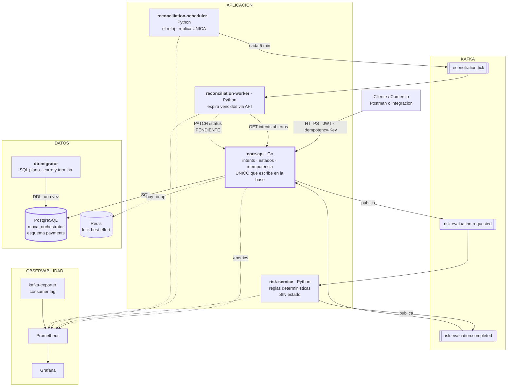
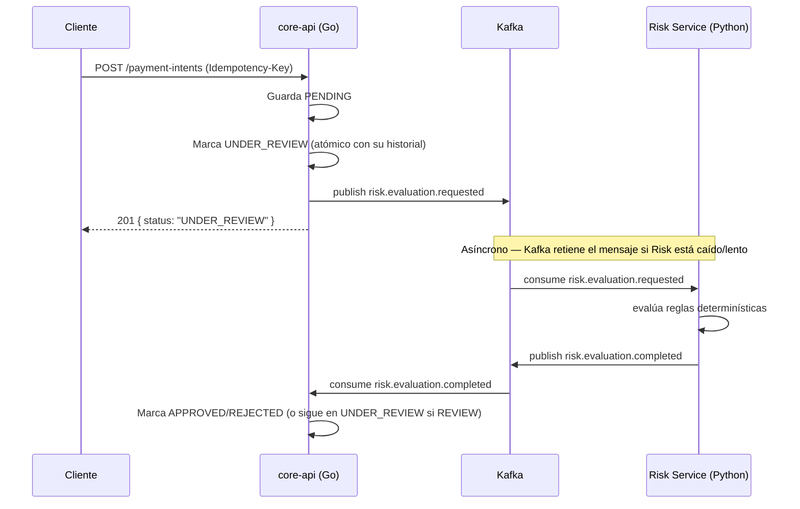
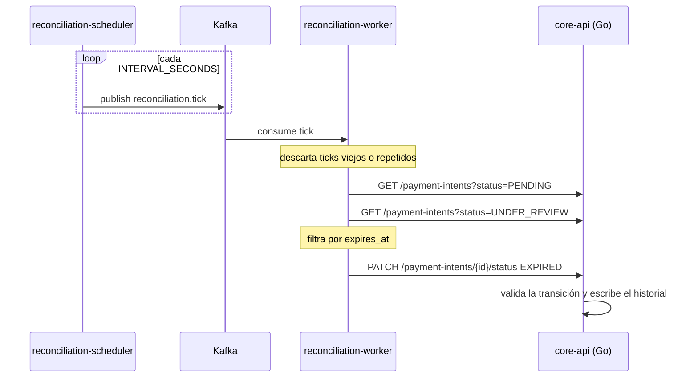
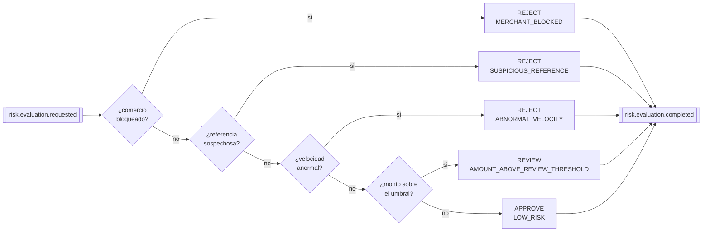
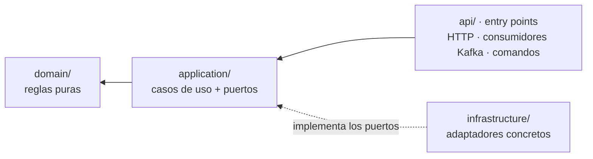
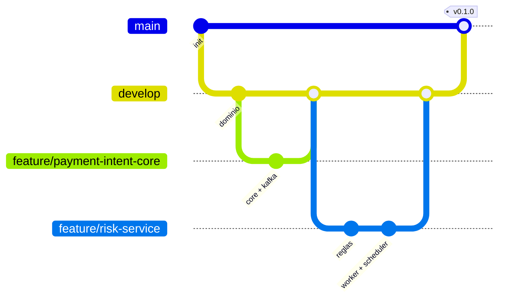

# MOVA Payment Orchestrator

Vertical de procesamiento de pagos para comercios: Payment Intents con
evaluación de riesgo asíncrona, trazabilidad completa, e idempotencia
respaldada por base de datos. Trabajo en equipo — ver
[Matriz de contribuciones](#matriz-de-contribuciones) para quién hizo qué.

## Arquitectura



| | Significa |
|---|---|
| Línea sólida | Camino en funcionamiento |
| Línea punteada | Opcional, degradable o **pendiente** |
| Borde grueso | La fuente de verdad y su único escritor |

**Lo que el diagrama deja ver de un vistazo:** el riesgo nunca toca la base y ni siquiera conoce al
core —solo intercambia eventos—; el reloj está separado del ejecutor; y el worker entra por la misma
puerta que cualquier cliente. La única flecha punteada del camino de negocio es el `PATCH /status`
que [falta implementar](#integración-pendiente-patch-status).

| Componente | Tecnología | Responsabilidad | Dueño | Documentación |
|---|---|---|---|---|
| `core-api` | Go | Payment Intents, estados, idempotencia, API HTTP | Valentina | — |
| `risk-service` | Python | Evaluación de riesgo, reglas determinísticas | Sergio | [README](risk-service/README.md) |
| `reconciliation-scheduler` | Python | El reloj: publica el tick de conciliación | Sergio | [README](reconciliation-scheduler/README.md) |
| `reconciliation-worker` | Python | Expira Payment Intents vencidos | Sergio | [README](reconciliation-worker/README.md) |
| `db-migrator` | SQL + `migrate` | Aplica migraciones y termina | Sergio | [Esquema](docs/esquema-de-datos.md) |
| PostgreSQL | Infra | Fuente de verdad — esquema listo, `core-api` aún en memoria | Sergio (esquema) | [Esquema](docs/esquema-de-datos.md) |
| Redis | Infra | Lock rápido de idempotencia — hoy un no-op | Pendiente (Eduard) | — |
| Kafka | Infra | Mensajería entre servicios | Valentina · Sergio | [ADR-0001](docs/adr/0001-contrato-go-python.md) |
| Prometheus + Grafana | Infra | Métricas y dashboard aprovisionado | Sergio | [Observabilidad](#observabilidad) |

**Límite no negociable:** ningún servicio Python escribe directo en las
tablas del core — todo pasa por eventos de Kafka o por la API pública de
`core-api`. No es una convención de equipo: **ninguno de los tres servicios
Python tiene cadena de conexión a la base en su entorno**. La única del
sistema es la de `core-api`.

| Proceso | Escribe en | Cómo obtiene los datos |
|---|---|---|
| `core-api` | **`mova_orchestrator`** | SQL propio · Kafka |
| `db-migrator` | El esquema, **solo DDL**, y termina | — |
| `risk-service` | Nada | Solo Kafka |
| `reconciliation-scheduler` | Nada | Solo Kafka, y solo produce |
| `reconciliation-worker` | Nada | Kafka el disparo · **API** los datos |

El worker consulta la API y no una proyección propia a propósito: una copia
local sería una segunda interpretación de los datos del core, siempre unos
milisegundos por detrás, y acabaría intentando cerrar pagos que ya cambiaron.

### Flujo



Ver [ADR-0001](docs/adr/0001-contrato-go-python.md) para el contrato
exacto de los eventos, y [ADR-0003](docs/adr/0003-politica-risk-service-caido.md)
para qué pasa si el Risk Service se demora, cae, o responde dos veces.

### Flujo de conciliación

Lo que cierra los pagos que se quedaron abiertos — un `UNDER_REVIEW` que nunca
se resolvió porque el Risk Service no volvió.



**El reloj va aparte del ejecutor** ([ADR-0006](docs/adr/0006-scheduler-como-servicio-aparte.md)):
el scheduler debe correr como réplica única y el worker querría escalar. Con el
bucle dentro del worker, dos réplicas eran dos relojes y trabajo duplicado.

## Servicios Python

Los tres son de Sergio. Cada uno tiene su README con el detalle completo; aquí
va lo que hay que saber para entender el sistema sin abrirlos.

### `risk-service` — la decisión de riesgo

Consume `risk.evaluation.requested`, aplica reglas determinísticas y publica
`risk.evaluation.completed`. **No tiene base de datos, ni caché, ni estado
persistente**, y no conoce a `core-api`: solo intercambia eventos.



Se evalúan **en orden de severidad y la primera que dispara manda**: un comercio
bloqueado se rechaza aunque todo lo demás esté limpio, y una referencia
sospechosa se rechaza aunque el monto sea bajo. Un `merchant_status` ausente o
desconocido **no bloquea**: rechazar por no saber tumbaría las aprobaciones cada
vez que los dos lados se desalinean.

El `score` no es un modelo: es una suma acotada a `[0,100]` que se puede
explicar en voz alta — 5 de base, hasta 20 graduales por monto, 55 si supera el
umbral, 95 si disparó una regla bloqueante. El componente gradual existe para
que **discrimine dentro de una misma decisión**: dos pagos aprobados de 1.000 y
de 90.000 COP no deberían tener el mismo número.

`model_version` (`rules-v2`) viaja en cada respuesta y `core-api` la persiste: si
mañana cambian los umbrales, se sabe con qué versión se decidió cada pago
histórico. `v2` añadió la regla de comercio bloqueado.

**La velocidad se cuenta sin tocar la base.** Manda el `merchant_recent_intents`
que publica `core-api` —exacto con varias réplicas y a prueba de reinicios—, y
si el campo no viene se usa una ventana deslizante en memoria alimentada por los
eventos que el servicio ya consume. Las dos fuentes usan la misma semántica: el
intent que se evalúa no se cuenta a sí mismo. El registro local es idempotente
por `payment_intent_id`, porque Kafka entrega al menos una vez y una reentrega
inventaría un rechazo
([ADR-0004](docs/adr/0004-velocidad-sin-acceso-a-la-base.md)).

→ [README completo](risk-service/README.md) · [OpenAPI](docs/openapi/risk-service-v1.yaml)

### `reconciliation-scheduler` — el reloj

Publica `reconciliation.tick` cada `INTERVAL_SECONDS` y nada más. Sin base, sin
credencial de API, sin decisiones.

Es el **único proceso que debe correr como réplica única**, y por eso es también
el que no puede hacer daño: se puede reiniciar o desplegar en cualquier momento
porque un ciclo perdido se recupera en el siguiente.

El `tick_id` es determinista por ventana de tiempo, así que dos schedulers vivos
durante un despliegue producen el mismo id y el worker descarta el duplicado.

→ [README completo](reconciliation-scheduler/README.md) · [ADR-0006](docs/adr/0006-scheduler-como-servicio-aparte.md)

### `reconciliation-worker` — cierra lo que quedó abierto

Consume el tick, lista los intents abiertos y solicita su expiración **por la
API pública**. Nunca toca la base: el cambio pasa por la máquina de estados, el
historial con actor y las mismas validaciones que cualquier otro.

| Estado | ¿Se expira? | Por qué |
|---|---|---|
| `PENDING` | Sí | Se creó pero nunca llegó a evaluarse |
| `UNDER_REVIEW` | Sí | El riesgo no respondió nunca ([ADR-0003](docs/adr/0003-politica-risk-service-caido.md)) |
| Terminales | No | Pedirlo daría `422` y sería ruido |

Son exactamente los dos estados desde los que la tabla del dominio permite salir
a `EXPIRED`: el worker no inventa su propia idea de qué es legal.

**La ventana la define el core**, no el worker: se usa el `expires_at` que puso
al crear el intent. Si los dos tuvieran su propia noción de cuándo vence un
pago, tarde o temprano discreparían.

Su resiliencia es la parte con más cuidado: reintenta la infraestructura y nunca
el dominio, con backoff exponencial y jitter completo, y un circuit breaker
propio. **Solo esta capa reintenta en toda la cadena** — si el core reintentara
también, un fallo produciría nueve llamadas en vez de tres, y hay una prueba que
afirma el número exacto ([ADR-0005](docs/adr/0005-reintentos-y-breaker-del-worker.md)).

→ [README completo](reconciliation-worker/README.md)

### Lo que comparten los tres

| | |
|---|---|
| **Sin credenciales de la base** | La única cadena de conexión del sistema es la de `core-api` |
| **Configuración validada al arrancar** | Si falta algo obligatorio el proceso no levanta, en vez de fallar en la primera petición |
| **Logs JSON con `correlation_id`** | Es el único hilo que permite seguir un pago cruzando Go y Python |
| **`/health` ≠ `/readiness`** | Un consumidor vivo pero sin broker está arriba y no sirve para nada |
| **Métricas sin cardinalidad no acotada** | Ninguna etiqueta lleva `merchant_id` ni `payment_intent_id` |
| **74 pruebas sin red ni contenedores** | Es la prueba de que la separación por capas es real |

### Estructura de carpetas

```
MOVA_prueba_grupal/
├── core-api/                  # Go — dominio, aplicación, infraestructura, transporte
│   ├── cmd/api/
│   ├── internal/
│   │   ├── domain/
│   │   ├── application/
│   │   ├── infrastructure/{kafka,memory,redis,postgres}/
│   │   └── transport/http/
│   └── migrations/            # vacía — pendiente (ver Pendientes)
├── risk-service/               # Python — reglas de riesgo, consumidor Kafka
│   ├── app/{domain,application,infrastructure,api}/
│   └── tests/                  # 35 tests, ninguno necesita red
├── reconciliation-scheduler/   # Python — el reloj, publica el tick
│   ├── scheduler/
│   └── tests/                  # 5 tests
├── reconciliation-worker/      # Python — expira intents vencidos vía API
│   ├── worker/{domain,application,infrastructure}/
│   └── tests/                  # 34 tests, core simulado con respx
├── migrations/                 # SQL plano, .up y .down, aplicado por db-migrator
├── observability/
│   ├── prometheus/             # scrape config
│   └── grafana/{provisioning,dashboards}/
├── docs/
│   ├── adr/                    # decisiones, una por archivo
│   └── esquema-de-datos.md     # DDL, triggers, roles y las garantías verificadas
└── docker-compose.yml
```

### Cómo están estructurados los servicios Python

Los tres siguen la misma forma, para que quien revise uno reconozca el
siguiente. La regla de dependencia es estricta y va **hacia adentro**:



| Capa | Qué vive ahí | Qué **no** puede importar |
|---|---|---|
| `domain/` | Entidades, reglas, invariantes | Nada. Ni framework, ni red, ni reloj, ni las otras capas |
| `application/` | Casos de uso y los puertos que necesitan | Framework, HTTP, Kafka, SQL |
| `infrastructure/` | Implementaciones concretas de los puertos | — |
| `api/` · entry points | Traducir de fuera hacia el caso de uso | Dominio directamente |

**La prueba de que la separación es real** no es que las carpetas tengan esos
nombres: es que `domain/` se prueba sin levantar nada. Las 74 pruebas de los
tres servicios corren sin red ni contenedores, y eso solo es posible si la
dependencia apunta de verdad hacia adentro.

**Un caso de uso, varias entradas.** El `risk-service` se invoca por Kafka y por
HTTP; el `reconciliation-worker`, por el tick y por un comando manual. En los
dos, las entradas son adaptadores finos sobre el mismo caso de uso, así que la
ruta de prueba no puede divergir de la de producción.

| Servicio | Entradas | Detalle |
|---|---|---|
| `risk-service` | Consumidor Kafka · `POST /api/v1/risk-evaluations` | [Estructura](risk-service/README.md#estructura) |
| `reconciliation-scheduler` | Bucle de reloj | [Estructura](reconciliation-scheduler/README.md#estructura) |
| `reconciliation-worker` | Consumidor del tick · `python -m worker.run_once` | [Estructura](reconciliation-worker/README.md#estructura) |

### Estructura documental

Cada cosa vive en un solo sitio, y el resto enlaza:

| Documento | Responde a | Cuándo se toca |
|---|---|---|
| Este README | *¿Qué es el sistema y cómo lo levanto?* | Cuando cambia la arquitectura o el arranque |
| `<servicio>/README.md` | *¿Qué hace este proceso, cómo decide y qué falla?* | En la misma PR que cambia el servicio |
| [`docs/contratos-entre-servicios.md`](docs/contratos-entre-servicios.md) | *¿Quién le habla a quién y qué pasa si falla?* | Al cambiar cualquier contrato |
| [`docs/adr/`](docs/adr/) | *¿Por qué se hizo así y qué se descartó?* | Cuando se toma una decisión con alternativas |
| [`docs/esquema-de-datos.md`](docs/esquema-de-datos.md) | *¿Cómo son los datos y qué garantizan?* | En la misma PR que una migración |

**Regla:** si una decisión tenía alternativas viables, va en un ADR. Si es solo
*qué hace* algo, va en el README del servicio. Un README que explica un porqué
largo suele ser un ADR que nadie escribió.

Cada README de servicio sigue la misma estructura —**dónde encaja, cómo decide,
qué configura, qué métricas emite y qué puede salir mal**— para que quien revise
uno reconozca el siguiente. Y todos enlazan sus ADRs asociados arriba del todo.

## Requisitos

- Docker + Docker Compose
- Go 1.25+ (solo si querés correr `core-api` fuera de Docker)
- Python 3.12+ (solo si querés correr los servicios Python fuera de Docker)

## Ejecución

```bash
cp .env.example .env
docker compose up -d --build
```

Levanta Postgres, Redis, Kafka, `core-api`, `risk-service` y
`reconciliation-worker` juntos. La API queda en
`http://localhost:${PORT}` (`8095` por defecto en `.env.example` — `8080`
suele estar ocupado por otros servicios locales en Windows).

Verificar que arrancó bien:

```bash
curl http://localhost:8095/readiness
```

## Variables de entorno

Ver [`.env.example`](.env.example). Resumen:

| Variable | Descripción |
|---|---|
| `PORT` | Puerto HTTP de `core-api` |
| `DB_*`, `DATABASE_URL` | Postgres (no usado todavía por `core-api` — ver Pendientes) |
| `REDIS_PORT`, `REDIS_ADDR` | Redis (no usado todavía por `core-api` — ver Pendientes) |
| `KAFKA_BROKERS` | Broker(s) de Kafka, separados por coma |
| `JWT_SECRET`, `JWT_EXPIRATION_MINUTES`, `AUTH_USERNAME`, `AUTH_PASSWORD` | Autenticación (ver PR de auth) |
| `REVIEW_AMOUNT_MINOR`, `VELOCITY_*`, `SUSPICIOUS_REFERENCE_PREFIXES` | Umbrales de las reglas de riesgo |
| `RECONCILIATION_INTERVAL_SECONDS` | Cada cuánto corre un ciclo de conciliación |
| `EXPIRY_OVERRIDE_MINUTES` | Solo demo: cierra por antigüedad en vez de esperar los 30 min |

## Endpoints

| Método | Ruta | Auth | Descripción |
|---|---|---|---|
| `GET` | `/readiness` | No | Confirma que Kafka es alcanzable |
| `POST` | `/api/v1/auth/login` | No | Autentica con la credencial de servicio, devuelve un JWT |
| `POST` | `/api/v1/payment-intents` | **Sí** | Crea un Payment Intent (requiere `Idempotency-Key`) |
| `GET` | `/api/v1/payment-intents` | **Sí** | Lista con filtros `merchant_id`, `status`, `page`, `limit` |
| `GET` | `/api/v1/payment-intents/{id}` | **Sí** | Consulta un Payment Intent |
| `GET` | `/api/v1/payment-intents/{id}/history` | **Sí** | Historial de cambios de estado |
| `PATCH` | `/api/v1/payment-intents/{id}/status` | **Sí** | **No implementado todavía** — lo necesita el worker, ver abajo |

Los servicios Python exponen lo suyo aparte:

| Servicio | Puerto | Rutas |
|---|---|---|
| `risk-service` | `8081` | `/health`, `/readiness`, `/metrics`, `POST /api/v1/risk-evaluations` |
| `reconciliation-worker` | `8082` | `/metrics` |

#### Integración pendiente: `PATCH /status`

El `reconciliation-worker` necesita solicitar la transición a `EXPIRED`, y hoy
`core-api` no expone ninguna forma de cambiar el estado de un intent. El worker
está implementado y probado contra este contrato:

```
PATCH /api/v1/payment-intents/{payment_intent_id}/status
{ "status": "EXPIRED", "reason": "vencido sin resolverse dentro de la ventana" }
```

`200` con el intent, `409` si ya estaba en ese estado, `422` si la transición no
es válida. Las dos transiciones que hacen falta ya existen en la tabla del
dominio (`PENDING→EXPIRED` y `UNDER_REVIEW→EXPIRED`), así que es solo el
handler.

Mientras no exista, el worker detecta el `404`, corta el ciclo y sale con código
`2` — se distingue de una caída a propósito, para que no se confunda un
pendiente de integración con un problema de disponibilidad.

### Contratos y colección de Postman

Los cinco contratos del sistema —quién habla con quién, con qué forma y qué pasa
cuando falla— están en
[`docs/contratos-entre-servicios.md`](docs/contratos-entre-servicios.md).

| Artefacto | Qué es |
|---|---|
| [`docs/openapi/core-api-v1.yaml`](docs/openapi/core-api-v1.yaml) | Contrato de `core-api`, **escrito desde el lado del consumidor**. Incluye el `PATCH /status` pendiente, marcado con `x-status: pendiente` |
| [`docs/openapi/risk-service-v1.yaml`](docs/openapi/risk-service-v1.yaml) | Generado del código con [`scripts/export-openapi.sh`](scripts/export-openapi.sh) |
| [`docs/postman/`](docs/postman/MOVA.postman_collection.json) | Colección de demo con `pm.test` en cada petición, y su entorno |

Swagger UI del `risk-service` sale gratis en http://localhost:8081/docs.

**La colección afirma, no solo dispara.** 18 peticiones en 5 carpetas con 28
aserciones: que el reintento devuelve el mismo intent, que el dinero es entero,
que cada entrada del historial está atribuida, que la referencia duplicada da
`409` y no `201`.

```bash
newman run docs/postman/MOVA.postman_collection.json \
       -e docs/postman/MOVA.postman_environment.json
```

O el script equivalente, que además comprueba las garantías del esquema con
`psql` y el estado de la observabilidad:

```bash
docker compose up -d
./scripts/demo.sh
```

| Carpeta | Demuestra |
|---|---|
| 0 · Salud | Que todo está arriba, y que `/readiness` distingue de `/health` |
| 1 · Autenticación | Login y el `401` sin credencial |
| 2 · Reglas de riesgo | Las tres decisiones contra `risk-service`, y que el score discrimina |
| 3 · Payment Intents | Creación, **reintento idempotente**, historial atribuido, `409` por referencia duplicada |
| 4 · Conciliación | Lo que ve el worker, y el `PATCH` pendiente — marcado como informativo para que no rompa la corrida |

### Autenticación

No hay tabla de usuarios — una única credencial de servicio configurada
por variables de entorno (`AUTH_USERNAME`/`AUTH_PASSWORD`), igual que en
el proyecto individual de referencia. `POST /auth/login` devuelve un JWT
(HS256, expira según `JWT_EXPIRATION_MINUTES`); el resto de los
endpoints de pagos exige `Authorization: Bearer <token>`. El `subject`
del token queda como `changed_by` en cada entrada del historial.

```bash
curl -X POST http://localhost:8095/api/v1/auth/login \
  -H "Content-Type: application/json" \
  -d '{"username":"...","password":"..."}'
```

## Observabilidad

```bash
docker compose up -d prometheus grafana
```

| Servicio | URL | Credenciales |
|---|---|---|
| Grafana | http://localhost:3000 | `admin` / `admin` |
| Prometheus | http://localhost:9090 | — |

El dashboard **MOVA Payment Orchestrator — Riesgo y Conciliación** se aprovisiona
como código desde [`observability/grafana/dashboards/`](observability/grafana/dashboards/).
Nada se crea a mano en la interfaz: un dashboard que solo existe en la base de
Grafana desaparece con el volumen.

Cuatro filas, y cada panel responde a una pregunta concreta:

| Fila | Qué contesta |
|---|---|
| **Riesgo** | Qué se aprueba y qué se rechaza, qué regla dispara, si llegan eventos malformados |
| **Conciliación** | Cuántos vencidos se cierran, estado del circuit breaker, ciclos abortados y por qué |
| **Reloj** | Si el scheduler sigue vivo y si el worker lo está escuchando |
| **Kafka** | Consumer lag por grupo — la señal que dice si alguien dejó de consumir sin haberse caído |

### Las métricas que importan

| Métrica | Por qué |
|---|---|
| `reconciliation_scheduler_last_tick_timestamp` | Si deja de avanzar, **nadie está conciliando y ninguna otra métrica lo diría**: el worker inactivo se ve igual que "no hay trabajo pendiente" |
| `reconciliation_circuit_breaker_state` | En `2`, el core está caído y el worker falla rápido en vez de gastar timeouts |
| `risk_events_consumed_total{outcome="malformed"}` | Debería ser cero. Si no, el contrato del ADR-0001 cambió sin avisar |
| `kafka_consumergroup_lag` | Un consumidor que se queda atrás sin estar caído |

Ninguna métrica lleva `merchant_id` ni `payment_intent_id` como etiqueta: son de
cardinalidad no acotada y convertirían cada comercio en una serie nueva. Es una
regla de revisión, no una recomendación.

## Pruebas

```bash
cd core-api
go test ./...                        # unitarias, sin dependencias externas
go test -tags=integration ./...      # contra Kafka real (requiere docker compose up)
```

- `internal/domain` (10 tests): reglas de validación, tabla de
  transiciones completa, aplicación de decisiones de riesgo.
- `internal/application` (9 tests): `PaymentIntentService` con
  repositorios falsos en memoria — incluye un test de concurrencia real
  (20 goroutines, misma `idempotency_key`, una sola fila creada).
- `internal/infrastructure/memory` (7 tests): los repositorios
  temporales en memoria.
- `internal/infrastructure/auth` (4 tests): firma/validación de JWT
  (round-trip, secreto incorrecto, expirado, malformado).
- `internal/middleware` (3 tests): `RequireAuth` — token válido,
  ausente, inválido.
- `internal/infrastructure/kafka` (3 tests, integración): productor,
  consumidor, y `EnsureTopics`, contra un broker Kafka real.
- `internal/transport/http` (15 tests, 1 de integración): login,
  endpoints de pagos protegidos (incluye el caso sin token → 401), y
  `/readiness` contra Kafka real.

### Servicios Python

```bash
cd risk-service              && .venv/bin/python -m pytest    # 35
cd reconciliation-scheduler  && .venv/bin/python -m pytest    #  5
cd reconciliation-worker     && .venv/bin/python -m pytest    # 34
```

**74 pruebas y ninguna necesita red ni contenedores.** Las reglas de riesgo son
una función pura, así que se prueban con una tabla de casos; el cliente HTTP se
prueba con `respx` contra las rutas y los cuerpos reales del contrato.

Tres merecen mención porque afirman algo que se puede romper sin darse cuenta:

| Prueba | Qué protege |
|---|---|
| `test_kafka_contract.py` | Valida contra el **payload literal** del ADR-0001. Si Go cambia el evento, falla aquí |
| `test_no_reintenta_indefinidamente` | Afirma el número exacto de llamadas: impide que alguien añada un segundo nivel de reintentos y multiplique la carga |
| `test_una_reentrega_no_infla_el_contador` | Kafka entrega al menos una vez; sin idempotencia, un reproceso inventaría un rechazo por velocidad |

Calidad, además de pruebas:

```bash
.venv/bin/python -m ruff check .    # lint y formato
.venv/bin/python -m mypy            # tipado estricto
```

Los tres servicios pasan `mypy --strict` sin excepciones salvo el módulo
`aiokafka`, que no publica `py.typed`.

### Esquema de datos

Las nueve garantías del esquema están verificadas contra un PostgreSQL real
—transición ilegal, historial inmutable, cambio sin historial, llave duplicada,
resolución sin riesgo, borrado con historial, permisos del rol— y listadas en
[`docs/esquema-de-datos.md` §8](docs/esquema-de-datos.md). Se reproducen con
`psql` en la sustentación.

## Decisiones documentadas (ADR)

- [ADR-0001 — Contrato Go/Python vía Kafka](docs/adr/0001-contrato-go-python.md)
- [ADR-0002 — Idempotencia y concurrencia](docs/adr/0002-idempotencia.md)
- [ADR-0003 — Estado seguro ante fallas del Risk Service](docs/adr/0003-politica-risk-service-caido.md)
- [ADR-0004 — Velocidad sin acceso a la base del core](docs/adr/0004-velocidad-sin-acceso-a-la-base.md)
- [ADR-0005 — Reintentos, timeouts y circuit breaker del worker](docs/adr/0005-reintentos-y-breaker-del-worker.md)
- [ADR-0006 — El reloj de conciliación va en un servicio aparte](docs/adr/0006-scheduler-como-servicio-aparte.md)
- [ADR-0007 — Migraciones como proceso aparte, SQL plano, una sola base](docs/adr/0007-migraciones-como-proceso-aparte.md)

| Servicio | ADRs que lo gobiernan |
|---|---|
| `core-api` | [0001](docs/adr/0001-contrato-go-python.md) · [0002](docs/adr/0002-idempotencia.md) · [0003](docs/adr/0003-politica-risk-service-caido.md) · [0007](docs/adr/0007-migraciones-como-proceso-aparte.md) |
| `risk-service` | [0001](docs/adr/0001-contrato-go-python.md) · [0003](docs/adr/0003-politica-risk-service-caido.md) · [0004](docs/adr/0004-velocidad-sin-acceso-a-la-base.md) |
| `reconciliation-scheduler` | [0006](docs/adr/0006-scheduler-como-servicio-aparte.md) |
| `reconciliation-worker` | [0003](docs/adr/0003-politica-risk-service-caido.md) · [0005](docs/adr/0005-reintentos-y-breaker-del-worker.md) · [0006](docs/adr/0006-scheduler-como-servicio-aparte.md) |
| `db-migrator` y el esquema | [0002](docs/adr/0002-idempotencia.md) · [0007](docs/adr/0007-migraciones-como-proceso-aparte.md) |

## Pendientes

Temporales, explícitamente marcados con `TODO` en el código:

- **`internal/infrastructure/memory/`**: implementación en memoria de los
  repositorios. **El esquema ya existe** (`migrations/`, aplicado por
  `db-migrator` y verificado contra PostgreSQL real), así que lo que falta es
  reemplazar este paquete por repositorios contra Postgres respetando la
  interfaz de `internal/application/ports.go`. Es el siguiente paso natural.
- **`internal/infrastructure/redis/noop_locker.go`**: lock de idempotencia
  que siempre "adquiere". El sistema sigue siendo correcto sin él (ver
  ADR-0002) — falta la implementación real contra Redis.

- **Circuit breaker Kafka→HTTP**: si Kafka mismo falla (no el Risk
  Service), el plan es caer a una llamada HTTP directa — quedó fuera de
  esta iteración, se agrega una vez que el camino feliz con Kafka esté
  probado en equipo.
- **`PATCH /api/v1/payment-intents/{id}/status`**: lo necesita el
  `reconciliation-worker` para cerrar los vencidos. Contrato y
  comportamiento esperado arriba, en [Endpoints](#endpoints). Es lo único
  que bloquea el camino completo de conciliación.
- **La ventana de velocidad en memoria del Risk Service**: ya no decide
  —manda el `merchant_recent_intents` que publica `core-api`— pero se
  mantiene como respaldo porque el campo es opcional. Se puede retirar el
  día que se decida que el contrato lo exige
  ([ADR-0004](docs/adr/0004-velocidad-sin-acceso-a-la-base.md)).

## Flujo de trabajo con Git

El historial cuenta cómo se construyó el sistema, no es una lista plana de
cambios.



| Rama | Propósito |
|---|---|
| `main` | Solo versiones liberadas y etiquetadas |
| `develop` | Integración del trabajo terminado |
| `feature/*` | Una rama por unidad de trabajo, nace y vuelve a `develop` |

**Nada se hace directamente sobre `main`.** Cada persona abre al menos dos Pull
Requests sustanciales y revisa al menos dos de sus compañeros, con
observaciones técnicas reales — una aprobación sin comentario no cuenta como
revisión.

Integraciones con `--no-ff`, para que el historial conserve la agrupación por
funcionalidad: se ve de un vistazo qué commits pertenecen a qué trabajo, y una
funcionalidad completa se revierte con un solo *revert* del *merge*.

### Convención de commits

`<emoji> <tipo>: <qué cambió, en imperativo y en minúscula>`

El emoji no es decoración: hace que `git log --oneline` se lea de un vistazo y
que en una revisión se vea al instante si una PR trae funcionalidad, seguridad o
solo documentación.

| Emoji | Tipo | Se usa para |
|---|---|---|
| 🎉 | `init` | Commit inicial de un servicio |
| ✨ | `feat` | Funcionalidad nueva |
| 🐛 | `fix` | Corrección de un defecto |
| 🗃️ | `db` | Migraciones, esquema, índices |
| 🔒️ | `security` | Autenticación, permisos, roles de base de datos |
| 📨 | `event` | Contratos de evento, productores, consumidores |
| 📈 | `metrics` | Instrumentación, dashboards, alertas |
| ♻️ | `refactor` | Cambio interno sin efecto observable |
| ✅ | `test` | Pruebas que no acompañan a un `feat` |
| 📝 | `docs` | README, ADRs, OpenAPI |
| 🐳 | `docker` | Compose, Dockerfiles, arranque |
| 🔧 | `chore` | Dependencias, CI, configuración |
| 🔀 | `merge` | Integración de una rama |
| 🔖 | `release` | Versión etiquetada |

```
✨ feat: implementar el reloj de conciliacion como servicio aparte
🗃️ db: agregar triggers de transicion e historial append-only
📨 event: consumir risk.evaluation.requested y publicar el resultado
🔒️ security: separar el rol de migraciones del rol de la aplicacion
📝 docs: documentar el esquema y sus nueve garantias verificadas
```

**Un tipo por commit.** Si una PR toca esquema, código y documentación, son tres
commits y no uno con tres emojis — así el `revert` de una parte no se lleva las
otras.

> Los commits anteriores a esta convención (`feat:`, `docs:` sin emoji) se dejan
> como están: reescribir el historial de ramas ya mergeadas cuesta más de lo que
> vale la uniformidad. Aplica de aquí en adelante.

### Definición de "terminado"

Una PR se puede mergear cuando cumple **todo**:

- Pruebas automatizadas que fallan sin el cambio y pasan con él.
- Lint, formato y tipos en verde en el stack que toca (`go test` y
  `golangci-lint`; o `ruff` y `mypy --strict`).
- El README del servicio refleja lo que hace ahora.
- Si la decisión tenía alternativas viables, hay un ADR.
- Al menos un comentario técnico real del revisor.
- Ningún secreto en el repositorio.

Las PRs se mantienen por debajo de ~400 líneas de diff. Una PR de dos mil
líneas no se revisa, se aprueba.

## Matriz de contribuciones

<!-- Se actualiza en cada PR: qué se implementó, quién lo revisó, y qué se aprendió. -->

| PR | Autor | Resumen | Archivos principales |
|---|---|---|---|
| `feature/payment-intent-core` | Valentina | Esqueleto del repo, dominio y aplicación de `PaymentIntent`, mensajería Kafka real (productor + consumidor + `EnsureTopics`), endpoints HTTP + `/readiness`, 3 ADRs. Persistencia real (Postgres/Redis) queda pendiente de Eduard — ver [Pendientes](#pendientes). | `core-api/internal/domain`, `core-api/internal/application`, `core-api/internal/infrastructure/{kafka,memory,redis}`, `core-api/internal/transport/http`, `docker-compose.yml`, `docs/adr/` |
| `feature/auth-middleware` | Valentina | Autenticación JWT (login + middleware) sobre los endpoints de pagos, sin tabla de usuarios — misma credencial de servicio del proyecto individual de referencia. `changed_by` en el historial ahora sale del subject del token, no de un valor fijo. | `core-api/internal/infrastructure/auth`, `core-api/internal/middleware`, `core-api/internal/transport/http/{auth_handler.go,auth_context.go,router.go}` |
| `feature/risk-service-reconciliation-worker` | Sergio | Los tres servicios Python (74 tests, `mypy --strict`): reglas de riesgo determinísticas sobre Kafka, el reloj de conciliación como servicio aparte, y el worker que expira intents vencidos vía API con reintentos, jitter y circuit breaker propios. Esquema de datos completo en SQL plano con triggers y roles, aplicado por un `db-migrator` externo y con las 9 garantías verificadas contra PostgreSQL real. Prometheus + Grafana con dashboard aprovisionado. 4 ADRs. Detectada y documentada una integración pendiente: `core-api` no expone `PATCH /status`, que el worker necesita. | `risk-service/`, `reconciliation-scheduler/`, `reconciliation-worker/`, `migrations/`, `observability/`, `docs/adr/0004`–`0007`, `docs/esquema-de-datos.md`, `docker-compose.yml` |
