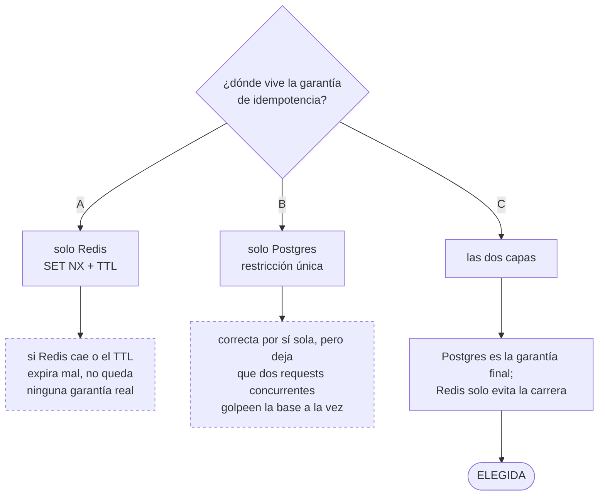
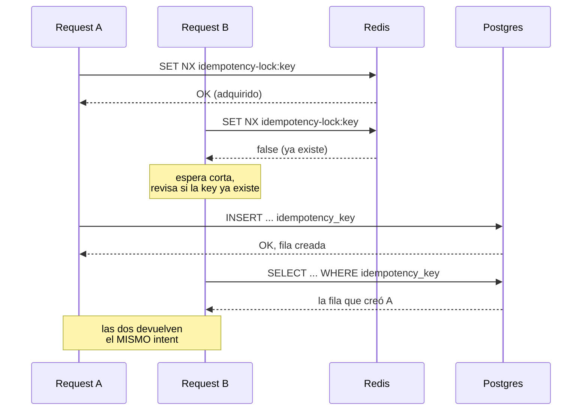

# ADR-0002: Estrategia de idempotencia y concurrencia

## Estado
Aceptado

## Contexto
Dos solicitudes concurrentes con la misma `idempotency_key` deben
devolver el mismo Payment Intent, nunca crear dos filas. La garantía no
puede depender únicamente de un componente que puede no estar disponible
(Redis).

## Decisión
Estrategia de **dos capas**, reutilizando el mismo patrón validado en el
proyecto individual de Go/Python:

1. **Restricción única en Postgres sobre `idempotency_key`** — la
   garantía final. Aunque todo lo demás falle, la base de datos nunca
   permite dos filas con la misma key.
2. **Lock best-effort en Redis** (`IdempotencyLocker.Acquire`) — una
   optimización para que dos requests concurrentes no lleguen ambos a
   intentar el `INSERT` al mismo tiempo. Si el lock no se consigue, se
   espera un instante corto y se vuelve a chequear si la key ya existe
   antes de seguir.

Si la restricción de Postgres rechaza el `INSERT` por conflicto
(`ErrConflict`), `PaymentIntentService.Create` busca el intent existente
por esa `idempotency_key` y lo devuelve — nunca propaga el conflicto como
un error al cliente cuando en realidad es un reintento legítimo.

**Si Redis no está disponible:** `IdempotencyLocker.Acquire` devuelve
`acquired=false` (ver `internal/infrastructure/redis/locker.go`) — el
mismo camino que ya toma cuando pierde la carrera contra otro request.
`PaymentIntentService.Create` espera un instante corto, revisa si la key
ya existe y, si no, sigue adelante igual: se pierde la optimización de
evitar que dos requests concurrentes golpeen la base al mismo tiempo,
pero la restricción única de Postgres sigue garantizando que nunca se
cree una fila duplicada. El sistema es correcto con o sin Redis; Redis
solo lo hace más eficiente bajo concurrencia real.

## Alternativas consideradas
- **Solo Redis (`SET NX` + TTL) sin restricción en Postgres:** se
  descartó — si Redis cae o el TTL expira en mal momento, no queda
  ninguna garantía real contra duplicados.
- **Lock pesimista en Postgres (`SELECT ... FOR UPDATE`) antes de
  insertar:** añade una consulta extra y contención en la tabla para un
  caso que la restricción única ya resuelve sin coordinación adicional.

## Consecuencias
- El comportamiento es correcto incluso sin Redis — se degrada en
  rendimiento, no en corrección.
- Probado con un test de concurrencia real (20 goroutines, misma
  `idempotency_key`, se verifica una sola fila) — ver
  `TestCreate_Concurrent_OnlyOneRowCreated`.
