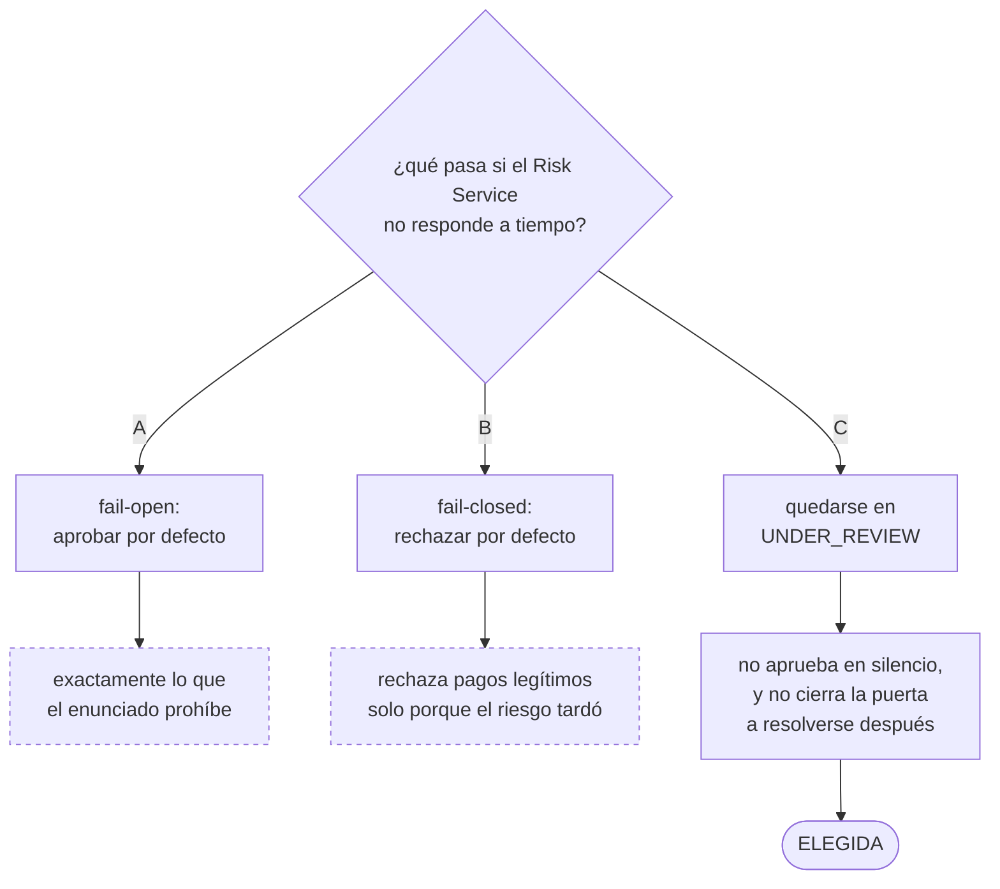
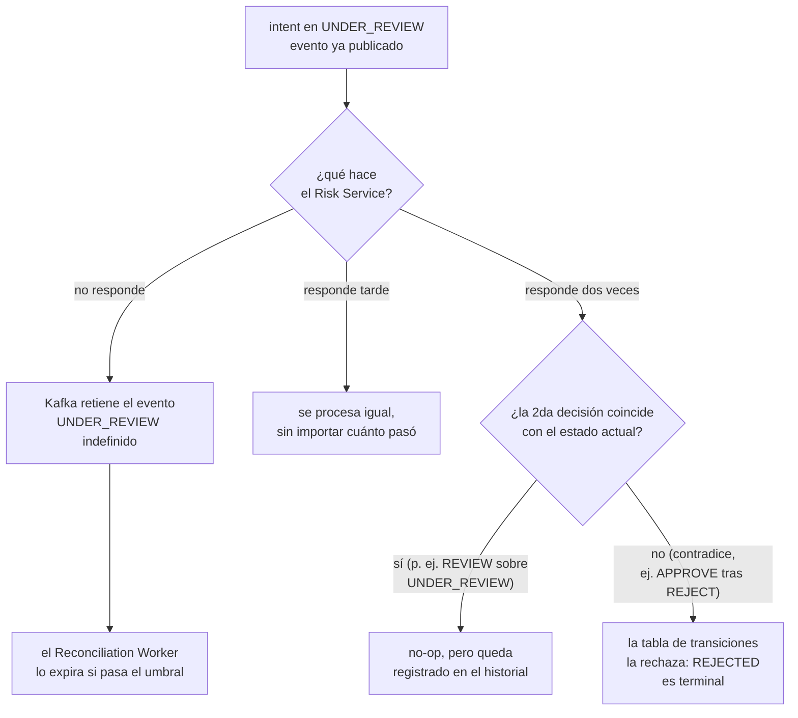

# ADR-0003: Estado seguro cuando el Risk Service se demora, falla o responde dos veces

## Estado
Aceptado

## Contexto
El enunciado exige explícitamente: *"Ante timeout del servicio de riesgo,
el core no debe aprobar silenciosamente; el equipo define y documenta el
estado seguro."* Con la comunicación asíncrona por Kafka (ver ADR-0001),
hay que definir qué pasa en cada uno de los tres escenarios de falla.

## Decisión
**`UNDER_REVIEW` es el estado seguro**, y no es un estado especial de
error — es el mismo estado al que **todo** Payment Intent pasa apenas se
envía a evaluación de riesgo (ver ADR-0001). Un pago nunca se aprueba
solo porque el riesgo no contestó a tiempo.

- **El Risk Service no responde / se cae:** el evento en
  `risk.evaluation.requested` simplemente espera en la cola — Kafka lo
  retiene. El Payment Intent se queda en `UNDER_REVIEW` (donde ya estaba
  desde que se envió) hasta que el Risk Service vuelva y consuma el
  mensaje pendiente. No hace falta ninguna lógica de timeout explícita en
  `core-api`: el estado seguro y la espera indefinida son, acá, la misma
  cosa.
- **El Risk Service responde tarde:** cuando finalmente publique en
  `risk.evaluation.completed`, el consumer de `core-api` lo procesa
  igual que cualquier otro mensaje — no importa cuánto tiempo pasó, el
  Payment Intent se resuelve correctamente en ese momento.
- **El Risk Service responde dos veces:** es inofensivo porque las
  reglas son determinísticas y sin efectos secundarios (mismo input,
  mismo output). Si de todos modos llegaran dos mensajes para el mismo
  `payment_intent_id`, `PaymentIntent.ApplyRiskDecision` solo transiciona
  si el estado destino es distinto del actual (`domain/payment_intent.go`)
  — una segunda aplicación de la misma decisión, o de `REVIEW` sobre un
  intent que ya está en `UNDER_REVIEW`, no es una transición inválida,
  simplemente no cambia el estado (aunque sí deja un registro en el
  historial, ver `TestApplyRiskDecision_Review_StaysUnderReview`). Si la
  segunda respuesta fuera contradictoria (ej. `APPROVE` después de
  `REJECT`), la tabla de transiciones la rechaza (`REJECTED` es
  terminal) — el error queda registrado, no aplicado silenciosamente.

## Alternativas consideradas
- **Timeout activo con reintento automático desde `core-api`:** requeriría
  un mecanismo adicional (worker o scheduler) para reintentar la
  publicación o marcar el intent como fallido tras N minutos. Se decidió
  no construirlo en esta iteración porque Kafka ya resuelve la parte de
  "no perder el mensaje"; lo que falta (expirar un `UNDER_REVIEW` muy
  viejo) es responsabilidad del Reconciliation Worker de Sergio, no de
  `core-api`.
- **Aprobar por defecto tras un timeout ("fail open"):** rechazado de
  plano — es exactamente el comportamiento que el enunciado prohíbe
  explícitamente.
- **Rechazar por defecto tras un timeout ("fail closed"):** más seguro que
  aprobar, pero rechaza pagos legítimos solo porque el riesgo tardó —
  `UNDER_REVIEW` indefinido es preferible porque no le cierra la puerta a
  una resolución correcta más tarde.

## Consecuencias
- Ningún Payment Intent puede terminar `APPROVED`/`REJECTED` sin que el
  Risk Service efectivamente haya respondido — esa garantía la da la
  tabla de transiciones del dominio, no una validación ad-hoc en cada
  punto de entrada.
- Un `UNDER_REVIEW` que nunca se resuelve (Risk Service caído
  permanentemente) queda detectable por el Reconciliation Worker, que lo
  marca `EXPIRED` pasado el umbral configurado — responsabilidad de
  Sergio, documentada acá para que quede claro el límite entre ambos
  componentes.
