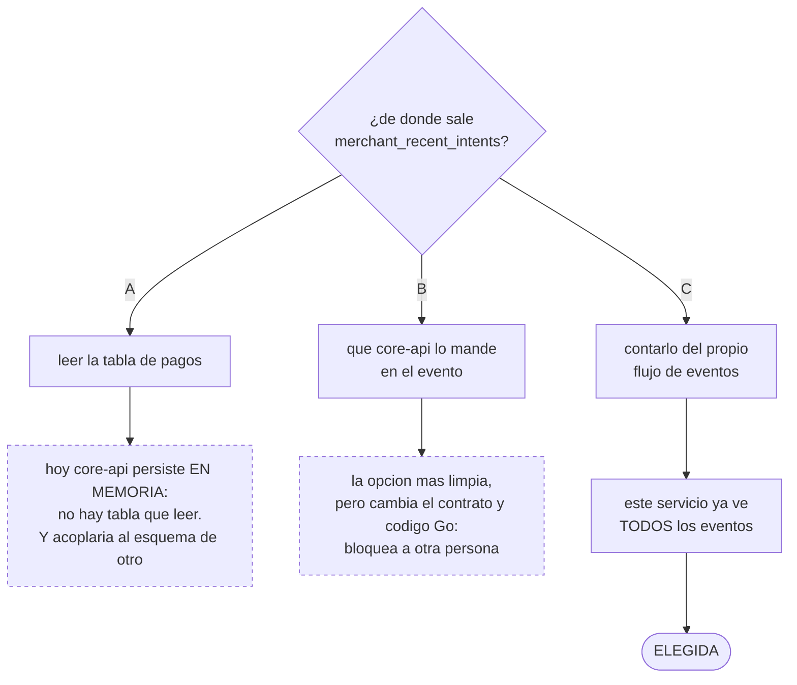
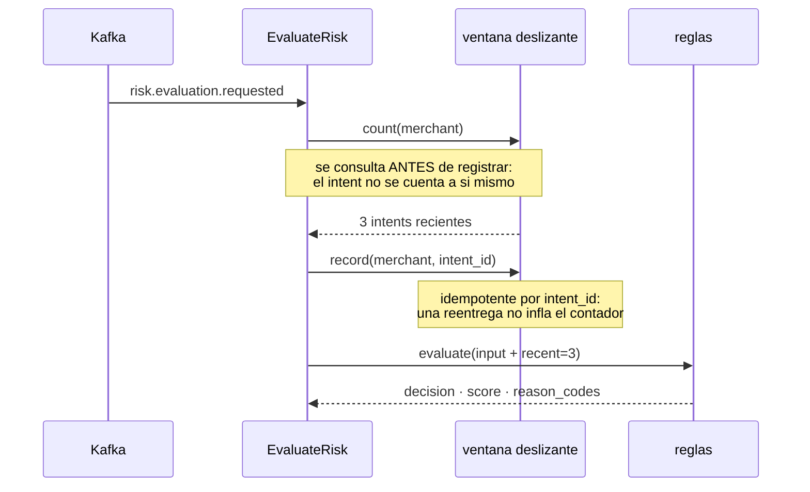

# ADR-0004: Cómo el Risk Service calcula la velocidad sin leer la base del core

## Estado
Aceptado

## Contexto
Una de las reglas de riesgo que pide el enunciado es la **velocidad anormal**:
rechazar cuando un comercio genera demasiados intents en poco tiempo. Para
evaluarla hace falta saber cuántos intents recientes tiene ese comercio.

Ese dato **no viene en el evento**. El payload de `risk.evaluation.requested`
(ver ADR-0001) trae `payment_intent_id`, `merchant_id`, `external_reference`,
`amount_minor`, `currency`, `channel` y `correlation_id` — y nada más.

Hay además dos hechos que acotan las opciones:

- El límite del reto dice que Python consume contratos públicos del core y no
  puede actualizar sus tablas ni convertirse en una segunda fuente de verdad.
- Hoy `core-api` persiste **en memoria** (`internal/infrastructure/memory/`,
  ver README → Pendientes). No existe una base de pagos que consultar aunque
  se quisiera.

Las tres formas de conseguir el dato, y por qué solo una está disponible hoy:

## Decisión
El Risk Service **cuenta por su cuenta**, sobre una ventana deslizante en
memoria alimentada por los eventos que ya consume.

Este servicio ve *todos* los eventos de evaluación, así que tiene la
información necesaria sin pedírsela a nadie. La cuenta se expone detrás de un
puerto (`application/ports.py::VelocityCounter`), de modo que el dominio no
sabe de dónde sale el número y se sigue probando como función pura.

Dos detalles que no son opcionales:

- **`record` es idempotente por `payment_intent_id`.** Kafka entrega al menos
  una vez; sin esto, una reentrega del mismo evento inflaría el contador e
  inventaría un rechazo por velocidad sobre un comercio que no hizo nada.
- **El intent que se está evaluando no se cuenta a sí mismo.** Se consulta
  antes de registrar. Si no, el primer pago de un comercio ya arrancaría con
  velocidad 1 y el umbral quedaría corrido en uno.

La ventana se poda en cada acceso, así que la memoria queda acotada por el
tráfico de la ventana y no por el histórico: un comercio que deja de operar
deja de ocupar espacio.

## Alternativas consideradas
- **Leer la tabla de pagos con un rol de solo lectura.** Es lo que haríamos si
  el dato solo existiera ahí. Se descarta por dos razones, en este orden: hoy
  no hay tal tabla (el core persiste en memoria), y aunque la hubiera, el Risk
  Service quedaría acoplado al esquema de otro componente — un cambio de
  columna del lado de Go rompería un servicio Python sin que nadie lo note
  hasta ejecutarlo.
- **Que `core-api` calcule la velocidad y la mande en el evento.** Es la opción
  más limpia a largo plazo: el core es dueño de ese dato y una consulta
  indexada le cuesta poco. Se descarta *para esta iteración* porque obliga a
  cambiar el contrato y el código de Go, que es trabajo de otra persona, y el
  acuerdo del equipo fue que cada quien entrega lo suyo sin bloquear a los
  demás. **Queda propuesto** como campo opcional `merchant_recent_intents`.
- **Redis compartido como contador.** Introduce estado, un modo de fallo nuevo
  y una fuente de verdad paralela, para un dato que se puede derivar del flujo
  que ya se está consumiendo.

## Consecuencias
- El Risk Service sigue sin base de datos y sin credenciales de ninguna: el
  límite del reto no depende de disciplina, depende de que no haya cadena de
  conexión en su entorno.
- La ventana es **por instancia** y se pierde al reiniciar. Con una sola
  réplica, que es como corre hoy, la cuenta es exacta. Con varias, cada una
  vería solo su fracción del tráfico y el umbral efectivo se multiplicaría por
  el número de réplicas — está anotado en el README del servicio.
- Un reinicio deja pasar hasta `VELOCITY_MAX_RECENT` intents antes de volver a
  disparar la regla. Se acepta: es un rechazo de menos, no una aprobación
  silenciosa, y ninguna decisión incorrecta se persiste.
- **La regla de comercio bloqueado no se puede implementar.** Necesitaría un
  `merchant_status` que el evento no trae y que `core-api` no expone. Se
  propone añadirlo al contrato junto con `merchant_recent_intents`; hasta
  entonces la regla no existe, y eso es preferible a inventarse un valor.
