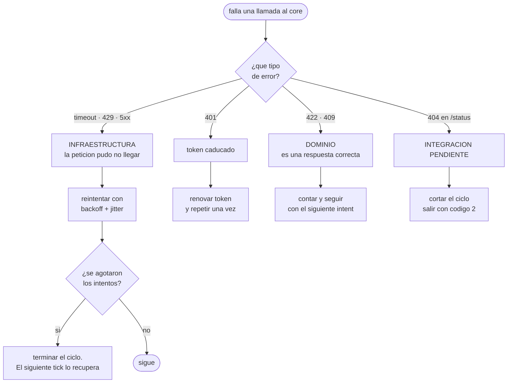
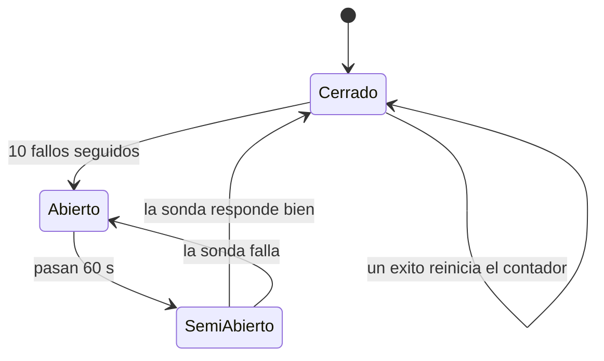

# ADR-0005: Reintentos, timeouts y circuit breaker del Reconciliation Worker

## Estado
Aceptado

## Contexto
El Reconciliation Worker es el único componente Python que **llama** al core
(el Risk Service solo publica y consume eventos). Esa llamada puede fallar de
muchas formas distintas, y tratarlas todas igual produce uno de dos errores:
reintentar algo que nunca va a funcionar, o rendirse ante algo transitorio.

Hay además un riesgo específico de tener reintentos en varias capas: si el
worker reintenta tres veces y el core reintentara otras tres por dentro, un
solo fallo produciría nueve llamadas. Con tres capas serían veintisiete. Es la
forma más rápida de convertir una degradación en una caída.

## Decisión

**1. Se reintenta la infraestructura, nunca el dominio.**

| Situación | ¿Reintentar? | Por qué |
|---|---|---|
| Timeout, conexión rechazada, `429`, `5xx` | Sí | La petición pudo no haber llegado |
| `401` | Sí, una vez | El token caducó: se renueva y se repite |
| `422 INVALID_TRANSITION` | No | Es una respuesta correcta. Daría `422` las tres veces |
| `409` | No | El intent ya está donde queríamos: es éxito |
| `404` en el endpoint de status | No | No es un fallo, es una integración pendiente |

**2. Solo esta capa reintenta en toda la cadena.** El worker es el origen del
trabajo, así que es quien reintenta. Hay una prueba que afirma el número exacto
de llamadas (`test_no_reintenta_indefinidamente`) precisamente para que nadie
añada un segundo nivel sin darse cuenta.

**3. Backoff exponencial con jitter completo:**
`espera = random(0, min(tope, base × 2^intento))`. El componente aleatorio evita
que varias réplicas reintenten sincronizadas y tumben al core justo cuando se
está recuperando.

**4. Circuit breaker por dependencia, escrito a mano** (~80 líneas en
`infrastructure/resilience.py`).

Con el breaker **cerrado** y el core caído, cada intent gasta sus 2 s de timeout
por 3 intentos antes de rendirse. Con el breaker **abierto**, el ciclo termina
en milisegundos. El resultado para los pagos es el mismo; lo que cambia es que
el worker no se queda esperando. Su valor no es dejar de llamar, sino **fallar
rápido hacia el estado seguro**: con el core caído y el breaker cerrado, cada
intent gasta su timeout completo antes de rendirse; con el breaker abierto, el
ciclo termina de inmediato y el siguiente disparo lo reintenta. El resultado
para los pagos es el mismo; lo que cambia es que el worker no se queda
esperando.

**5. Un ciclo perdido no se recupera dentro del ciclo.** Si el core no
responde, el ciclo entero se abandona y se registra. No se reintenta el ciclo
completo ni se encola nada: un pago vencido no empeora por esperar, y el
siguiente disparo lo recupera. La única consecuencia es un retraso.

**6. `404` sobre el endpoint de transición se distingue de una caída.** Se
levanta `StatusEndpointMissing`, que corta el ciclo y hace que el comando salga
con código `2`. Repetir el mismo `404` por cada intent solo llenaría los logs y
escondería el problema real, que es de integración y no de disponibilidad.

## Alternativas consideradas
- **Una librería de circuit breaker.** Las opciones mantenidas en Python son
  escasas y ninguna emite las métricas que necesitamos con las etiquetas de
  este proyecto. Ochenta líneas propias, probadas, cuestan menos que una
  dependencia que hay que envolver igualmente.
- **Reintentar el ciclo completo cuando el core no responde.** Descartada:
  duplica el trabajo justo cuando el otro lado está degradado, que es el peor
  momento para insistir. El intervalo entre ciclos ya es el reintento.
- **Cola de trabajo con reintento por intent (Celery o similar).** Descartada
  por alcance: añade un broker y un modelo de estado que hay que operar, para
  un trabajo que es idempotente y cuyo reintento natural es el siguiente ciclo.

## Consecuencias
- Un fallo del core produce exactamente `MAX_RETRIES + 1` llamadas por
  petición, y está afirmado por una prueba.
- El worker degrada de forma predecible: retrasa, no pierde y no inventa.
- El breaker añade estado en memoria y un modo de fallo propio — un breaker
  abierto por un pico transitorio rechaza llamadas que habrían funcionado. Se
  acepta porque el coste de equivocarse es un ciclo de retraso, no un pago mal
  resuelto.
- Las métricas de reintentos y del breaker (`reconciliation_retry_attempts_total`,
  `reconciliation_circuit_breaker_state`) hacen visible la degradación en vez de
  esconderla en los logs.
