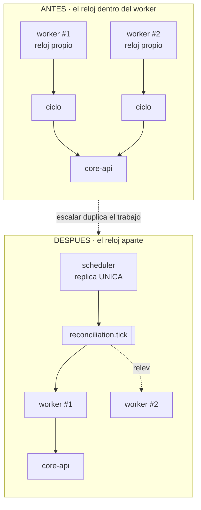
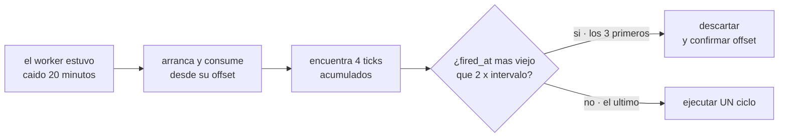

# ADR-0006: El reloj de conciliación va en un servicio aparte y dispara por Kafka

## Estado
Aceptado

## Contexto
La conciliación necesita un reloj: alguien tiene que decir "empieza un ciclo"
cada cierto tiempo. La primera versión del `reconciliation-worker` llevaba ese
bucle dentro del propio proceso.

Eso funciona con una réplica y se rompe con dos: cada instancia tendría su
propio reloj y dispararía su propio ciclo, así que el trabajo se duplicaría.
Los ciclos son idempotentes —el segundo encontraría los pagos ya cerrados— pero
duplican la carga de lectura sobre `core-api` y hacen imposible saber, desde
fuera, si el ciclo se está ejecutando o no.

Hay un segundo problema, de responsabilidad: el proceso que decide *cuándo*
trabajar y el que *hace* el trabajo tienen requisitos opuestos. El primero debe
correr como réplica única; el segundo querría escalar.

## Decisión
**Separar el reloj del ejecutor en dos contenedores**, y que el disparo viaje
por Kafka.

- `reconciliation-scheduler` publica en el topic `reconciliation.tick` cada
  `INTERVAL_SECONDS`. No consulta la API, no lee ninguna base y no toma
  ninguna decisión.
- `reconciliation-worker` consume ese topic y ejecuta el ciclo.

**Kafka y no un broker de tareas.** El sistema ya tiene Kafka con su
configuración, su exporter y su modelo de entrega; añadir Redis como broker de
Celery habría metido una segunda pieza de mensajería para publicar un mensaje
cada cinco minutos, y habría convertido a Redis —que hoy es un no-op y se puede
perder sin consecuencias— en una dependencia crítica de la conciliación.

**El `tick_id` es determinista por ventana de tiempo** (`reconcile:<epoch de la
ventana>`). Si durante un despliegue hubiera dos schedulers vivos unos
segundos, ambos producen el mismo id y el worker descarta el duplicado. No
sustituye a la regla de réplica única, pero evita que un solapamiento breve
genere trabajo doble.

**Los ticks viejos se descartan.** Un worker que vuelve tras estar caído
encuentra los ticks acumulados en el topic. Procesa solo los recientes y
descarta los que superan dos veces el intervalo: un tick de hace media hora no
aporta nada, porque el ciclo pregunta por el estado *actual* y no por el de
entonces. Procesarlos todos sería repetir el mismo ciclo N veces justo cuando
el sistema acaba de recuperarse.

**Un tick fallido no se reintenta.** El siguiente sale igual y cubre exactamente
el mismo trabajo.

**`max_poll_interval_ms` alto y explícito** (600 s). Un ciclo con miles de pagos
puede tardar minutos; con el valor por defecto, Kafka expulsaría al consumidor a
mitad del trabajo y repartiría la partición a otra réplica, que empezaría de
cero. El síntoma sería un rebalanceo continuo sin que nada parezca estar
fallando.

**El ciclo se ejecuta en un hilo aparte.** El caso de uso es síncrono (`httpx`)
y puede tardar; bloquear el bucle de eventos provocaría justo el rebalanceo que
`max_poll_interval_ms` intenta evitar.

## Alternativas consideradas
- **Dejar el bucle dentro del worker.** Es lo que había. Simple con una
  réplica, incorrecto con dos, y opaco desde fuera: no hay forma de distinguir
  "no hay nada que conciliar" de "el reloj se paró".
- **Cron del sistema operativo dentro del contenedor.** El disparo dejaría de
  ser observable —no hay lag, ni tick registrado, ni métrica de última
  ejecución— y cada réplica dispararía el suyo. Es el mismo problema con otra
  cara.
- **Celery beat + worker sobre Redis.** Es la separación que ya usa el proyecto
  individual de referencia y funciona bien. Se descarta aquí porque metería un
  segundo transporte de mensajería en un sistema que ya tiene Kafka, y porque
  volvería crítico a un Redis que hoy es prescindible.
- **Un job de Kubernetes / cron externo.** Correcto en un despliegue real, pero
  el entregable es un `docker compose` y no hay orquestador donde apoyarse.

## Consecuencias
- El worker puede escalar sin duplicar disparos: varias réplicas en el mismo
  grupo de consumo se reparten los ticks, y con una sola partición solo una
  ejecuta cada ciclo. Las demás quedan de relevo en caliente.
- El scheduler es el proceso con menos superficie del sistema: su entorno solo
  tiene `KAFKA_BROKERS` y un intervalo. Aunque alguien añadiera código por
  error, no tendría con qué llamar a nadie.
- `reconciliation_scheduler_last_tick_timestamp` detecta un reloj muerto, y
  `reconciliation_consumer_up` detecta un worker que no escucha. Son dos fallos
  distintos y hacían falta dos métricas: sin la primera, un scheduler caído se
  vería igual que un sistema sin trabajo pendiente.
- Un contenedor más que operar, y el disparo pasa a depender de Kafka. Si Kafka
  cae, no hay conciliación — pero tampoco hay pagos nuevos que conciliar,
  porque `core-api` también depende de Kafka para el flujo de riesgo.
- La regla de réplica única del scheduler es operativa, no técnica. Si alguien
  escala el servicio a dos, los `tick_id` deterministas amortiguan pero no
  resuelven. Una elección de líder queda evaluada y aplazada: añade un modo de
  fallo para resolver un problema que en esta escala no existe.
