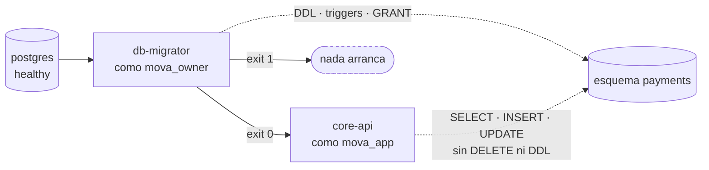
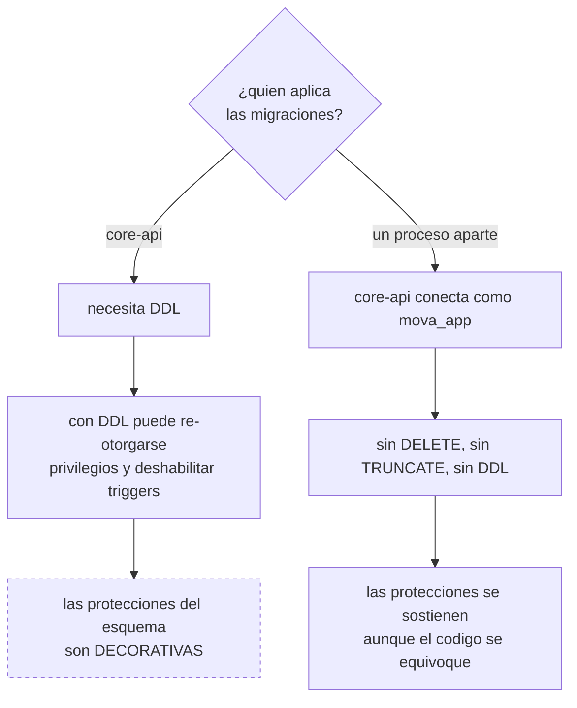

# ADR-0007: Las migraciones son un proceso aparte, en SQL plano y contra una sola base

## Estado
Aceptado

## Contexto
`core-api` persiste en memoria (`internal/infrastructure/memory/`) y el
directorio de migraciones estaba vacío. Sin esquema real no hay restricción
única que respalde la idempotencia, ni triggers que protejan el historial: las
garantías que documentan ADR-0002 y ADR-0003 existían solo dentro del proceso
Go, y se perdían al reiniciarlo.

Hay que decidir tres cosas a la vez: **quién** aplica las migraciones, **en qué
formato** se escriben y **cuántas bases** hay.

**Por qué importa la separación de roles**, que es la razón real y no el orden
de arranque:

## Decisión

**1. Un proceso aparte, que corre y termina.** `db-migrator` es un contenedor
de un solo uso (`migrate/migrate`) que aplica los `.sql` y sale. Ningún
servicio arranca antes de que salga con éxito
(`condition: service_completed_successfully`).

La razón principal no es de orden, es de privilegios: si `core-api` aplicara
las migraciones necesitaría permisos de DDL, y con permisos de DDL puede
re-otorgarse cualquier privilegio y deshabilitar los triggers que protegen el
historial. **Toda la integridad del esquema descansa en que el rol de
migraciones y el rol de la aplicación sean distintos**, y separar el proceso es
lo que hace posible separar el rol.

Hay un segundo motivo, más mundano: con varias réplicas de `core-api`
arrancando a la vez, varias intentarían migrar al mismo tiempo.

**2. SQL plano, no un DSL.** El esquema depende de cosas que ningún ORM
expresa: `CONSTRAINT TRIGGER DEFERRABLE`, índices parciales, `REVOKE`,
funciones plpgsql. Y es la única forma que Go y Python entienden igual — un
servicio Go y tres Python no pueden compartir migraciones de Alembic ni de
GORM. En una revisión de código, un `.sql` se lee y se entiende.

**3. Una sola base, `mova_orchestrator`, con el esquema `payments`.** Se evaluó
separar identidad de pagos en dos bases; se descarta porque **no hay identidad
que separar**: `core-api` autentica contra una credencial de servicio fija, sin
tabla de usuarios. Una segunda base sin tablas es infraestructura por
simetría.

Los tres servicios Python no tienen credenciales de ninguna base: el
`risk-service` vive solo de eventos y los procesos de conciliación hablan por la
API pública. **La única cadena de conexión del sistema es la de `core-api`.**

**4. Tres roles dentro de esa base:** `mova_owner` (DDL), `mova_app` (la
aplicación, sin `DELETE` ni DDL) y `mova_auditor` (solo lectura).

**5. Cada `.up.sql` con su `.down.sql`**, para poder probar la migración de ida
y vuelta en CI antes de que llegue a ninguna parte.

## Alternativas consideradas
- **Migraciones dentro del arranque de `core-api`.** Es lo más simple y lo que
  hacen muchos proyectos. Descartada por el problema de privilegios: obliga a
  que la aplicación tenga DDL, y con DDL las protecciones del esquema son
  decorativas.
- **Alembic (Python) o golang-migrate embebido.** El primero ataría el esquema
  a un servicio Python que ni siquiera toca la base; el segundo vuelve al
  problema de privilegios. `migrate/migrate` como contenedor separado aplica el
  mismo SQL sin acoplarlo a ningún lenguaje.
- **Dos bases, una de identidad y otra de pagos.** Es lo correcto cuando hay
  usuarios, roles y credenciales que aislar. Aquí no los hay. Si `core-api`
  llegara a tener una tabla de usuarios, esta decisión se revisa.
- **`ON DELETE CASCADE` en el historial.** Descartada: borrar un intent se
  llevaría su historial. En un dominio contable, el borrado en cascada es una
  forma silenciosa de destruir evidencia. Se usa `RESTRICT`.

## Consecuencias
- Las garantías del esquema se pueden **demostrar con `psql`** delante de quien
  pregunte, no solo afirmar: las nueve están verificadas contra un PostgreSQL
  real y listadas en [`docs/esquema-de-datos.md`](../esquema-de-datos.md).
- Añadir una transición implica una migración, no solo un cambio de código. Es
  fricción deliberada: una transición nueva en una máquina de estados
  financiera merece revisión.
- El arranque tiene un paso más y `docker compose up` tarda unos segundos
  adicionales la primera vez.
- **El esquema existe pero `core-api` todavía no lo usa.** Falta reemplazar
  `internal/infrastructure/memory/` por repositorios contra PostgreSQL,
  respetando la interfaz de `internal/application/ports.go`. Es el siguiente
  paso natural y queda anotado en Pendientes.
- La tabla de transiciones es **datos**, así que una prueba puede compararla
  con el mapa del dominio Go y fallar si divergen. Sin eso hay dos verdades
  sobre la misma máquina de estados.
