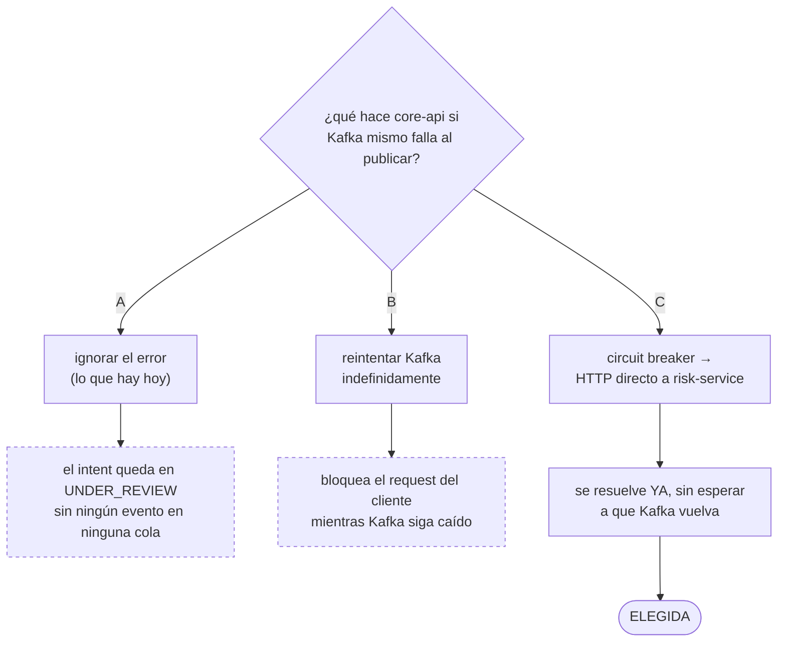
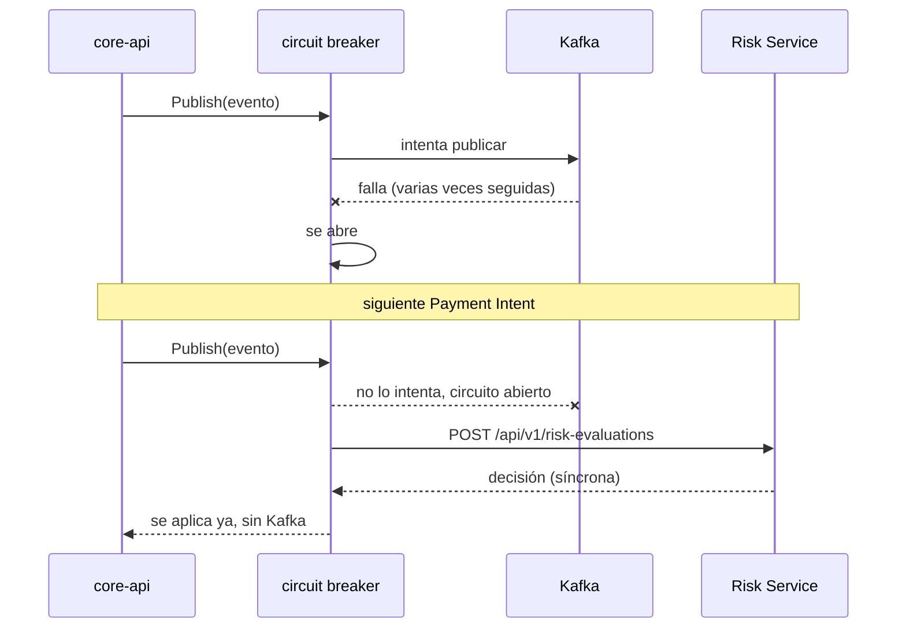

# ADR-0008: Circuit breaker Kafka→HTTP cuando el broker mismo falla

## Estado
Aceptado

## Contexto
El ADR-0003 ya resuelve qué pasa si **el Risk Service** se cae o se
demora: el evento espera en `risk.evaluation.requested` y Kafka lo
retiene hasta que vuelva. Pero hay un escenario distinto que ese ADR no
cubre: **¿qué pasa si Kafka mismo no está disponible?**

Hoy `PaymentIntentService.Create` publica el evento como *best-effort*
(`_ = s.riskEvent.Publish(...)`) — si Kafka falla, el error se ignora y
el intent queda en `UNDER_REVIEW` sin que exista ningún mensaje
esperando en ninguna cola. A diferencia del caso del ADR-0003, acá no
hay nada que Kafka pueda "retener": el evento nunca se publicó. El
intent solo se resolvería cuando alguien reintente crearlo o cuando el
`reconciliation-worker` lo expire por vencido, y mientras tanto tampoco
hay forma de saber si Kafka está caído sin mirar los logs.

## Decisión
Un **circuit breaker** (mismo diseño que ya usa el
`reconciliation-worker` en Python,
`worker/infrastructure/resilience.py`: cerrado/abierto/semi-abierto)
envuelve el intento de publicar a Kafka. Mientras está cerrado, todo
sigue como antes. Si Kafka falla varias veces seguidas, el breaker se
abre y **las siguientes llamadas ni siquiera intentan Kafka**: van
directo al endpoint síncrono que `risk-service` ya expone para pruebas
y demos (`POST /api/v1/risk-evaluations`), y la decisión se aplica de
inmediato con `PaymentIntentService.ApplyRiskResult` — el mismo camino
que usa el consumer de Kafka cuando la respuesta llega por el tópico.

El umbral es más bajo que el del worker (3 fallos / 30s, contra 10/60s):
esto corre en el camino **síncrono** de creación de un pago, no en un
ciclo de fondo, así que conviene fallar rápido hacia el HTTP directo en
vez de dejar que varios requests paguen el timeout completo de Kafka
antes de que el breaker reaccione.

El breaker vive en `internal/infrastructure/kafka` (no es una
dependencia nueva: es la misma lógica del worker, reescrita en Go) y el
cliente HTTP de emergencia en `internal/infrastructure/riskhttp` — un
paquete aparte porque es una responsabilidad distinta a publicar en
Kafka, aunque las dos vivan detrás del mismo puerto
`application.RiskRequestPublisher`.

### Hallazgo relacionado: el consumer de resultados tampoco se reconectaba

Verificando el breaker en vivo (parar el contenedor de Kafka, crear un
pago, levantarlo de nuevo) apareció un problema **distinto y
preexistente**, del lado de consumir en vez de publicar:
`RiskResultConsumer.Run` (el que aplica `risk.evaluation.completed`) no
tenía ningún mecanismo de reconexión — un solo error de lectura hacía
que la goroutine terminara para siempre, silenciosamente, por el resto
de la vida del proceso. Un Payment Intent que hubiera entrado a Kafka
justo antes de la caída se quedaba en `UNDER_REVIEW` de forma
permanente, aunque Kafka volviera y `risk-service` sí publicara su
resultado — nadie del lado de `core-api` seguía escuchando.

Se corrigió con el mismo patrón de backoff con jitter que ya usa el
`reconciliation-worker` en Python: si `ReadMessage` falla, `Run` cierra
el *reader* actual, espera con backoff creciente, crea uno nuevo y
sigue — en vez de devolver el error y morir. Verificado en vivo: con el
arreglo, un pago creado mientras Kafka estaba caído (y que por eso
había quedado en `UNDER_REVIEW`, esperando un evento que sí llegó a
publicarse después) se resolvió solo al reconectar, sin reiniciar
`core-api`.

## Alternativas consideradas
- **Ignorar el error (lo que había).** Es lo más simple, pero deja el
  intent sin ninguna forma de resolverse si Kafka tarda en volver más
  de lo que dura la ventana de expiración.
- **Reintentar Kafka con backoff dentro del mismo request.** Bloquea el
  request HTTP del cliente mientras Kafka siga caído — exactamente el
  problema que el ADR-0001 ya evitó para el caso normal (Risk Service
  lento), reintroducido acá para el caso de que sea Kafka el que falle.
- **Reintentos en segundo plano fuera del request.** Requeriría un
  worker o cola propia dentro de `core-api` para reintentar los eventos
  fallidos — más infraestructura para un caso que el HTTP directo ya
  resuelve de forma más simple.

## Consecuencias
- Un Payment Intent puede resolverse por dos caminos distintos —Kafka
  normal, o HTTP directo cuando Kafka está caído— y el historial sí
  distingue cuál fue: el actor (`changed_by`) es `risk-service` en los
  dos casos, pero el motivo (`reason`) del camino de emergencia queda
  marcado explícito (*"...vía HTTP directo, Kafka no disponible"*), para
  poder auditar después por cuál se resolvió cada pago.
- La respuesta de `POST /payment-intents` deja de ser siempre
  `UNDER_REVIEW`: si el breaker ya está abierto, la decisión llega en el
  mismo request y el `POST` puede devolver el intent ya resuelto
  (`APPROVED`/`REJECTED`), con `risk_decision`/`risk_score` llenos en
  vez de vacíos.
- Si **también** falla el HTTP directo (`risk-service` caído, no solo
  Kafka), el intent se queda en `UNDER_REVIEW` — sigue siendo el estado
  seguro (ADR-0003), y el `reconciliation-worker` lo expira si
  corresponde.
- El breaker es por instancia de `core-api`, no compartido — con varias
  réplicas, cada una descubre a su propio ritmo si Kafka volvió. Es
  aceptable en esta escala: no hay coordinación entre réplicas para
  ningún otro estado del sistema tampoco.
