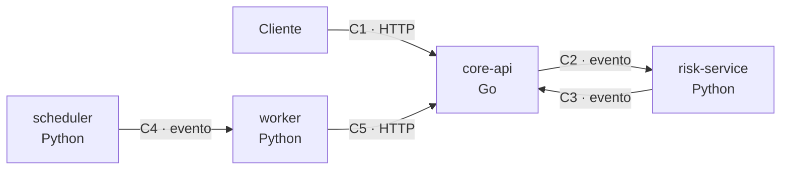
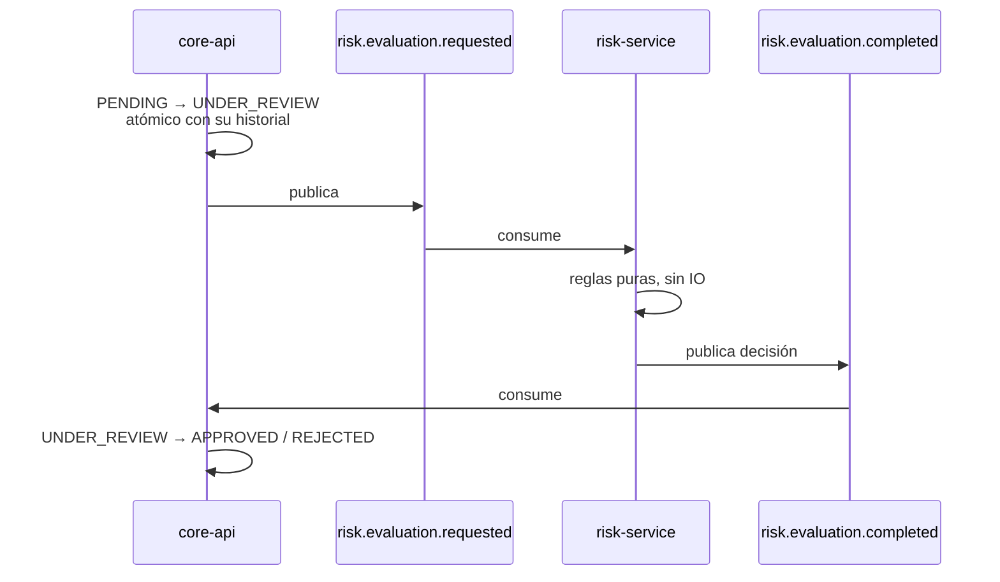
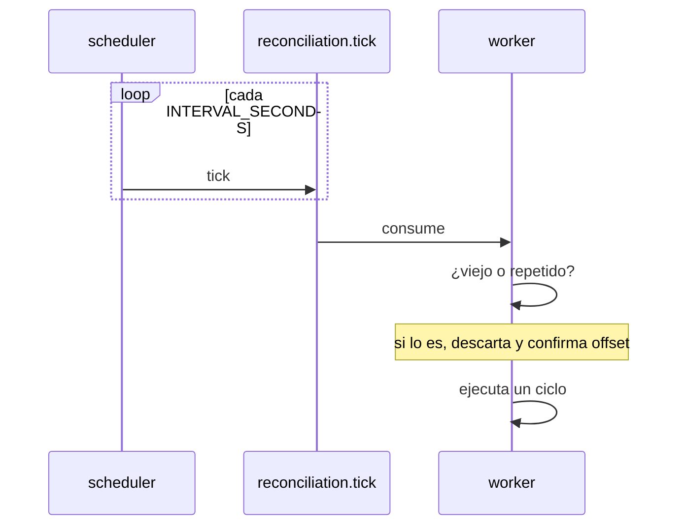
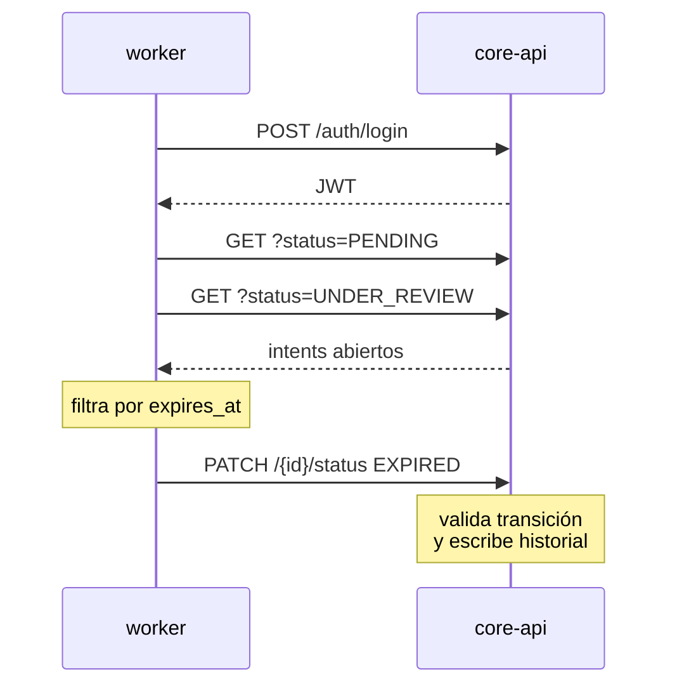
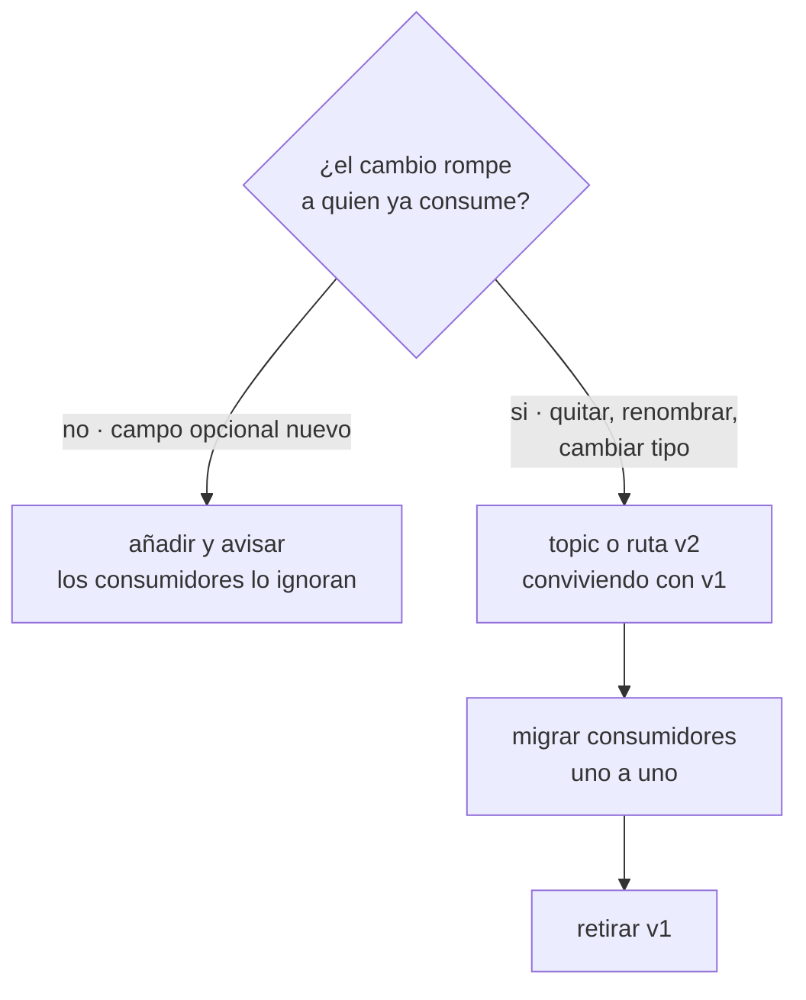

# Contratos entre servicios

Quién le habla a quién, con qué forma y qué pasa cuando falla. Si vas a tocar
algo que cruce el límite entre dos servicios, empieza aquí.

---

## 1. El mapa



| # | Contrato | De → A | Transporte | Especificación |
|---|---|---|---|---|
| **C1** | API pública | Cliente → `core-api` | HTTP + JWT | [`openapi/core-api-v1.yaml`](openapi/core-api-v1.yaml) |
| **C2** | Solicitud de riesgo | `core-api` → `risk-service` | Kafka | [ADR-0001](adr/0001-contrato-go-python.md) |
| **C3** | Resultado de riesgo | `risk-service` → `core-api` | Kafka | [ADR-0001](adr/0001-contrato-go-python.md) |
| **C4** | Disparo de conciliación | `scheduler` → `worker` | Kafka | [ADR-0006](adr/0006-scheduler-como-servicio-aparte.md) |
| **C5** | Conciliación | `worker` → `core-api` | HTTP + JWT | [`openapi/core-api-v1.yaml`](openapi/core-api-v1.yaml) |

**Solo `core-api` escribe en la base.** Los tres servicios Python no tienen
cadena de conexión: hablan por evento o por la API pública. No es disciplina de
equipo, es que la credencial no existe en su entorno.

---

## 2. C2 y C3 · La evaluación de riesgo

Dos topics, uno de ida y otro de vuelta. `risk-service` no conoce a `core-api`:
no lo llama, no lo alcanza y no sabría cómo.



### Ida — `risk.evaluation.requested`

```json
{
  "payment_intent_id": "11111111-1111-1111-1111-111111111111",
  "merchant_id": "22222222-2222-2222-2222-222222222222",
  "external_reference": "ORDER-1001",
  "amount_minor": 15000000,
  "currency": "COP",
  "channel": "QR",
  "correlation_id": "33333333-3333-3333-3333-333333333333",
  "merchant_status": "ACTIVE",
  "merchant_recent_intents": 3
}
```

| Campo | Obligatorio | Nota |
|---|---|---|
| `payment_intent_id` · `merchant_id` · `amount_minor` | **Sí** | Sin ellos el evento va a descarte |
| `external_reference` | No | Vacío se trata como sospechoso |
| `currency` · `channel` | No | Por defecto `COP` y vacío |
| `correlation_id` | No | Se propaga si viene |
| `merchant_status` | No | `INACTIVE` produce `REJECT`. **Ausente o desconocido no bloquea** |
| `merchant_recent_intents` | No | La cuenta del core manda sobre la ventana propia del riesgo |

Los dos últimos se añadieron después del contrato original y son opcionales a
propósito: un `core-api` anterior no los manda y el riesgo debe seguir
decidiendo. Ninguno de los dos convierte "no sé" en un rechazo.

### Vuelta — `risk.evaluation.completed`

```json
{
  "payment_intent_id": "11111111-1111-1111-1111-111111111111",
  "decision": "APPROVE",
  "score": 12,
  "reason_codes": ["LOW_RISK"],
  "model_version": "rules-v2"
}
```

**Cinco campos, ni uno más.** `decision` es `APPROVE` · `REVIEW` · `REJECT`, y
`score` va de 0 a 100. `model_version` la persiste `core-api`: sin ella no se
sabría con qué reglas se decidió un pago histórico.

### Qué pasa si falla

| Situación | Qué ocurre | Qué **no** ocurre |
|---|---|---|
| `risk-service` caído | El evento espera en el topic. El intent sigue en `UNDER_REVIEW`, que es el estado seguro | Aprobación silenciosa |
| Responde tarde | Se aplica igual cuando llegue, sin importar cuánto pasó | Pérdida de la solicitud |
| Responde dos veces | Misma decisión: las reglas son puras. `ApplyRiskDecision` no transiciona si el destino es el actual | Doble transición |
| Evento malformado | Se cuenta, se registra y se descarta | Que bloquee la partición |

Detalle en [ADR-0003](adr/0003-politica-risk-service-caido.md).

---

## 3. C4 · El disparo de conciliación



```json
{
  "tick_id": "reconcile:1785000000",
  "fired_at": "2026-07-31T16:05:00Z",
  "interval_seconds": 300,
  "correlation_id": "44444444-4444-4444-4444-444444444444"
}
```

| Campo | Para qué |
|---|---|
| `tick_id` | Determinista por ventana. Dos schedulers producen el mismo y el worker deduplica |
| `fired_at` | El worker descarta los que superan dos veces el intervalo |
| `interval_seconds` | El worker sabe cuánto vale un tick sin leer su propia config |
| `correlation_id` | Acaba en el historial de cada pago que ese ciclo cierre |

**Un tick fallido no se reintenta.** El siguiente cubre el mismo trabajo, porque
el ciclo pregunta por el estado *actual*.

---

## 4. C5 · La conciliación contra la API



El worker **no decide nada sobre el estado**: pide la transición y el core la
valida contra su tabla. Si escribiera en la base directamente, el cambio no
pasaría por la máquina de estados ni dejaría historial con actor.

| Respuesta | Significa | Qué hace el worker |
|---|---|---|
| `200` | Transición aplicada | Cuenta `expired` |
| `409` | Ya estaba ahí | Cuenta `already` — **es éxito** |
| `422` | Transición inválida | Cuenta `rejected` y sigue |
| `404` / `405` | **El endpoint no existe** | Corta el ciclo, sale con código `2` |

> ⚠ **`PATCH /status` todavía no está implementado en `core-api`.** Es lo único
> que bloquea el camino completo de conciliación. El contrato exacto está en
> [`openapi/core-api-v1.yaml`](openapi/core-api-v1.yaml) marcado con
> `x-status: pendiente`.

---

## 5. La política de fallos de cada contrato

Un contrato no es solo la forma del mensaje: también es qué pasa cuando el otro
lado no responde. Sin esto acordado, cada consumidor inventa su propio timeout.

| Contrato | Timeout | Reintentos | Circuit breaker | Al agotarse |
|---|---|---|---|---|
| **C1** cliente → core | Del cliente | Del cliente, con `Idempotency-Key` | — | Error al cliente |
| **C2/C3** eventos de riesgo | — | Kafka retiene | — | El intent espera en `UNDER_REVIEW` |
| **C4** tick | — | **0** | — | El siguiente tick cubre lo mismo |
| **C5** worker → core | 2 s | 3, con backoff y jitter | 10 fallos → 60 s | Fin del ciclo |

Dos reglas gobiernan todo lo anterior:

**Se reintenta la infraestructura, nunca el dominio.** Un `422` daría `422` las
tres veces; un `409` significa que ya está donde queríamos.

**Solo una capa reintenta por cadena**, la más cercana al origen del trabajo. El
worker reintenta; el core no reintenta hacia él. Si ambos lo hicieran, un fallo
produciría nueve llamadas en vez de tres — hay una prueba que afirma el número
exacto.

Razonamiento completo en [ADR-0005](adr/0005-reintentos-y-breaker-del-worker.md).

---

## 6. Cómo se cambia un contrato



**Un contrato no se modifica en sitio.** Añadir un campo opcional es compatible
—los consumidores que no lo conocen lo ignoran—; quitarlo, renombrarlo o
estrechar su tipo no lo es, y va como `v2` conviviendo.

Antes de mergear un cambio de contrato:

- [ ] La especificación actualizada (`openapi/` o el ADR correspondiente)
- [ ] Las pruebas de contrato de **ambos lados** en verde
- [ ] Los consumidores listados en la tabla de §1, avisados

### Quién consume qué

Sin esta tabla nadie sabe a quién rompe un cambio.

| Contrato | Dueño | Consumidores |
|---|---|---|
| C1 · API pública | Valentina | Clientes · `worker` |
| C2 · `risk.evaluation.requested` | Valentina *(publica)* | `risk-service` |
| C3 · `risk.evaluation.completed` | Sergio *(publica)* | `core-api` |
| C4 · `reconciliation.tick` | Sergio | `reconciliation-worker` |
| C5 · transiciones por API | Valentina | `worker` |

---

## 7. Cómo se verifica que no se rompió

Los contratos se prueban en los dos lados, y cada prueba falla si el otro
cambia sin avisar:

| Prueba | Dónde | Qué protege |
|---|---|---|
| `test_kafka_contract.py` | `risk-service` | Valida contra el **payload literal** del ADR-0001. Si Go cambia el evento, falla |
| `test_el_resultado_se_puede_serializar_al_contrato` | `risk-service` | Que el resultado tenga las cinco claves exactas — atrapó un fallo real de serialización |
| `test_ticks.py` | `worker` | El contrato del tick, su antigüedad y el umbral |
| `test_core_client.py` | `worker` | Rutas y códigos reales del core, con `respx` |
| `kafka_integration_test.go` | `core-api` | Productor y consumidor contra un broker real |
| [`scripts/demo.sh`](../scripts/demo.sh) | Todo el sistema | 26 comprobaciones sobre el sistema levantado |
| [`docs/postman/`](postman/MOVA.postman_collection.json) | Todo el sistema | 18 peticiones con 28 aserciones |

```bash
docker compose up -d
./scripts/demo.sh
```

Recorre los cinco contratos de punta a punta y sale distinto de cero si algo
falla, para que sirva en CI y no solo en una pantalla.
