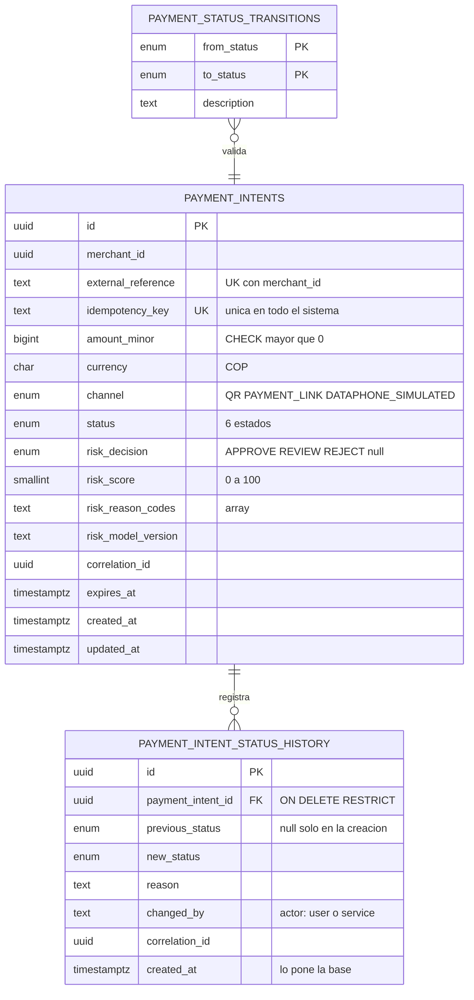

# Esquema de datos

DDL de referencia de `mova_orchestrator`. Es la fuente de la que salen las migraciones: si algo no
está aquí, no se crea.

Las decisiones detrás de esta forma están en [ADR-0002](adr/0002-idempotencia.md) (idempotencia),
[ADR-0003](adr/0003-politica-risk-service-caido.md) (estado seguro) y
[ADR-0007](adr/0007-migraciones-como-proceso-aparte.md) (migraciones y roles).

| | |
|---|---|
| Base | `mova_orchestrator` · esquema `payments` |
| Migraciones | [`migrations/`](../migrations/) — SQL plano, aplicado por `db-migrator` |
| Aplicación | `core-api` conecta como `mova_app` |

**Una sola base.** Los tres servicios Python no tienen credenciales de ninguna: el `risk-service`
vive solo de eventos y los procesos de conciliación hablan por la API pública del core. La única
cadena de conexión del sistema es la de `core-api`.

---

## 1. Diagrama



## 2. Tipos

```sql
CREATE TYPE payments.payment_channel AS ENUM ('QR', 'PAYMENT_LINK', 'DATAPHONE_SIMULATED');

CREATE TYPE payments.payment_status AS ENUM (
    'PENDING',        -- creado, aun no enviado a evaluacion
    'UNDER_REVIEW',   -- enviado a riesgo. Estado seguro (ADR-0003)
    'APPROVED', 'REJECTED', 'CANCELLED', 'EXPIRED'
);

CREATE TYPE payments.risk_decision AS ENUM ('APPROVE', 'REVIEW', 'REJECT');
```

Enums de PostgreSQL y no `TEXT` con `CHECK`: un valor inválido es imposible de insertar, y añadir un
estado obliga a una migración revisada en vez de a un despliegue silencioso.

## 3. payment_intents

```sql
CREATE TABLE payments.payment_intents (
    id                  UUID PRIMARY KEY DEFAULT gen_random_uuid(),
    merchant_id         UUID NOT NULL,
    external_reference  TEXT NOT NULL,
    idempotency_key     TEXT NOT NULL,

    amount_minor        BIGINT NOT NULL,
    currency            CHAR(3) NOT NULL DEFAULT 'COP',
    channel             payments.payment_channel NOT NULL,
    status              payments.payment_status NOT NULL DEFAULT 'PENDING',

    risk_decision       payments.risk_decision,
    risk_score          SMALLINT,
    risk_reason_codes   TEXT[],
    risk_model_version  TEXT,

    correlation_id      UUID NOT NULL,
    expires_at          TIMESTAMPTZ NOT NULL,
    created_at          TIMESTAMPTZ NOT NULL DEFAULT now(),
    updated_at          TIMESTAMPTZ NOT NULL DEFAULT now(),

    CONSTRAINT uq_intent_idempotency  UNIQUE (idempotency_key),
    CONSTRAINT uq_intent_external_ref UNIQUE (merchant_id, external_reference),

    CONSTRAINT ck_intent_amount   CHECK (amount_minor > 0),
    CONSTRAINT ck_intent_currency CHECK (currency = 'COP'),
    CONSTRAINT ck_intent_expires  CHECK (expires_at > created_at),
    CONSTRAINT ck_intent_score    CHECK (risk_score IS NULL OR risk_score BETWEEN 0 AND 100),

    CONSTRAINT ck_intent_risk_complete CHECK (
        (risk_decision IS NULL) = (risk_model_version IS NULL)
    ),
    CONSTRAINT ck_intent_no_silent_resolution CHECK (
        status NOT IN ('APPROVED', 'REJECTED') OR risk_decision IS NOT NULL
    )
);
```

**El dinero es `BIGINT` en unidad mínima.** Ningún punto flotante en ninguna capa: un `float` no
representa exactamente 0.1 y ese error se acumula transacción a transacción.

**`ck_intent_no_silent_resolution` merece atención.** La regla *"ningún pago se resuelve sin que el
riesgo haya respondido"* está en tres sitios: la tabla de transiciones del dominio, el trigger de §6
y este `CHECK`. El `CHECK` es el que sobrevive a cualquier `UPDATE` manual, y no cuesta nada.

**`ck_intent_risk_complete`** impide un estado a medias: los campos de riesgo van juntos o no van. Un
intent con `risk_decision` pero sin `risk_model_version` sería un pago del que no se sabe con qué
reglas se decidió.

### Índices

```sql
CREATE INDEX ix_intents_merchant        ON payments.payment_intents (merchant_id);
CREATE INDEX ix_intents_correlation     ON payments.payment_intents (correlation_id);
CREATE INDEX ix_intents_merchant_recent ON payments.payment_intents (merchant_id, created_at DESC);

CREATE INDEX ix_intents_open_by_expiry ON payments.payment_intents (expires_at)
    WHERE status IN ('PENDING', 'UNDER_REVIEW');
```

El último es parcial a propósito. El `reconciliation-worker` solo mira esos dos estados, y un índice
sobre las filas que de verdad se consultan cuesta una fracción de lo que costaría uno sobre una tabla
que solo crece.

## 4. payment_intent_status_history

```sql
CREATE TABLE payments.payment_intent_status_history (
    id                 UUID PRIMARY KEY DEFAULT gen_random_uuid(),
    payment_intent_id  UUID NOT NULL,

    previous_status    payments.payment_status,   -- NULL solo en la creacion
    new_status         payments.payment_status NOT NULL,
    reason             TEXT NOT NULL DEFAULT '',
    changed_by         TEXT NOT NULL,
    correlation_id     UUID NOT NULL,
    created_at         TIMESTAMPTZ NOT NULL DEFAULT now(),

    CONSTRAINT fk_history_intent FOREIGN KEY (payment_intent_id)
        REFERENCES payments.payment_intents (id) ON DELETE RESTRICT
);

CREATE INDEX ix_history_intent      ON payments.payment_intent_status_history (payment_intent_id, created_at);
CREATE INDEX ix_history_correlation ON payments.payment_intent_status_history (correlation_id);
CREATE INDEX ix_history_changed_by  ON payments.payment_intent_status_history (changed_by);
```

Cubre los cuatro campos que pide el enunciado —actor, motivo, correlación y fecha— y cada uno tiene
su razón de estar como está:

| Pide | Columna | Detalle |
|---|---|---|
| Actor | `changed_by` | Sale del subject del JWT o del nombre del servicio, **nunca de un campo que el llamador envíe** |
| Motivo | `reason` | Texto libre. `NOT NULL DEFAULT ''` para que nunca sea nulo y siempre se pueda mostrar |
| Correlación | `correlation_id` | Nace en `core-api`, viaja al evento de riesgo y vuelve. Un identificador reconstruye la vida completa de un pago cruzando Go y Python |
| Fecha | `created_at` | La pone `now()` de PostgreSQL, no la aplicación: **no es falseable desde el código** |

`ix_history_changed_by` existe para poder responder *"todo lo que hizo el reconciliation-worker"* con
un `WHERE` indexado. Sin él sería un `LIKE` sobre toda la tabla.

## 5. payment_status_transitions

```sql
CREATE TABLE payments.payment_status_transitions (
    from_status payments.payment_status NOT NULL,
    to_status   payments.payment_status NOT NULL,
    description TEXT NOT NULL,
    PRIMARY KEY (from_status, to_status)
);

INSERT INTO payments.payment_status_transitions VALUES
  ('PENDING',      'UNDER_REVIEW', 'enviado a evaluacion de riesgo'),
  ('PENDING',      'CANCELLED',    'cancelado antes de evaluarse'),
  ('PENDING',      'EXPIRED',      'vencido sin llegar a evaluarse'),
  ('UNDER_REVIEW', 'APPROVED',     'riesgo APPROVE'),
  ('UNDER_REVIEW', 'REJECTED',     'riesgo REJECT'),
  ('UNDER_REVIEW', 'EXPIRED',      'el riesgo nunca respondio (ADR-0003)');
```

**Seis filas y ninguna más.** `APPROVED`, `REJECTED`, `CANCELLED` y `EXPIRED` no aparecen nunca como
`from_status`: son terminales porque no tienen salida en la tabla, no porque alguien lo recuerde.

`PENDING → APPROVED` directo **no existe**. Todo pago pasa por `UNDER_REVIEW` al enviarse a riesgo,
así que ningún pago puede aprobarse sin evaluación — y eso no es una validación que se pueda olvidar,
es una transición que no está en el grafo ([ADR-0001](adr/0001-contrato-go-python.md)).

Como esto son **datos y no código**, una prueba de integración puede leer la tabla y compararla con
`allowedTransitions` de `core-api/internal/domain/payment_intent.go`. Sin eso hay dos verdades sobre
la misma máquina de estados, y se separan la primera vez que alguien añada una transición en un solo
lado.

## 6. Triggers

La validación en el dominio solo protege lo que pasa por el dominio. Un `UPDATE` desde `psql`, una
migración mal escrita o un script de soporte se la saltan entera. En un sistema financiero eso
importa: **si el historial se puede editar, no es evidencia de nada.**

```sql
-- 1. Transiciones ilegales, rechazadas vengan de donde vengan
CREATE TRIGGER trg_intent_transition
    BEFORE UPDATE OF status ON payments.payment_intents
    FOR EACH ROW EXECUTE FUNCTION payments.enforce_status_transition();

-- 2. El historial es append-only
CREATE TRIGGER trg_history_immutable
    BEFORE UPDATE OR DELETE ON payments.payment_intent_status_history
    FOR EACH ROW EXECUTE FUNCTION payments.reject_history_mutation();

-- 3. Ningun cambio de estado sin su fila de historial
CREATE CONSTRAINT TRIGGER trg_intent_requires_history
    AFTER INSERT OR UPDATE OF status ON payments.payment_intents
    DEFERRABLE INITIALLY DEFERRED
    FOR EACH ROW EXECUTE FUNCTION payments.require_history_row();
```

El tercero es el que cierra el círculo, y **tiene que ser `DEFERRABLE INITIALLY DEFERRED`**: valida
al `COMMIT` y no en medio de la transacción, porque el `UPDATE` del intent ocurre antes del `INSERT`
del historial. Con un trigger normal fallaría siempre.

Consecuencia práctica: el error aparece al hacer `COMMIT`, no en la sentencia, así que un bloque
`EXCEPTION` dentro de la transacción **no puede capturarlo**. Es el comportamiento correcto y conviene
saberlo antes de escribir una prueba que lo verifique.

El segundo es redundante con el `REVOKE` de §7 a propósito: el privilegio no cuesta nada en tiempo de
ejecución y cubre el caso normal; el trigger cubre el día en que alguien conecte con otro rol.

## 7. Roles y privilegios

| Rol | Puede | No puede |
|---|---|---|
| `mova_owner` | DDL y migraciones | Ser usado por la aplicación |
| `mova_app` | `SELECT/INSERT/UPDATE` en intents · `INSERT/SELECT` en historial | `DELETE`, `TRUNCATE`, DDL, alterar el historial |
| `mova_auditor` | `SELECT` en todo | Escribir cualquier cosa |

```sql
REVOKE ALL ON SCHEMA payments FROM PUBLIC;

GRANT SELECT, INSERT, UPDATE ON payments.payment_intents               TO mova_app;
GRANT SELECT, INSERT         ON payments.payment_intent_status_history TO mova_app;
GRANT SELECT                 ON payments.payment_status_transitions    TO mova_app;

REVOKE DELETE, TRUNCATE ON ALL TABLES IN SCHEMA payments          FROM mova_app;
REVOKE UPDATE, DELETE   ON payments.payment_intent_status_history FROM mova_app;
REVOKE CREATE           ON SCHEMA payments                        FROM mova_app, mova_auditor;
```

**El rol de migraciones es distinto del de la aplicación, y esa es la decisión de la que dependen
todas las demás.** Si `core-api` conectara como dueño del esquema, podría re-otorgarse permisos y
deshabilitar los triggers, y todo lo anterior sería decorativo.

Los privilegios cuestan **cero en tiempo de ejecución** —un `REVOKE` no se ejecuta en cada petición—
y no se pueden evadir desde el código.

## 8. Las nueve garantías, verificadas

Todas comprobadas contra un PostgreSQL real, no razonadas sobre el papel:

| # | Garantía | Mecanismo | Resultado |
|---|---|---|---|
| 1 | Un intent se crea con su historial en una transacción | Trigger diferido | ✅ pasa |
| 2 | `PENDING → APPROVED` directo se rechaza | `trg_intent_transition` | ✅ `check_violation` |
| 3 | `UPDATE` al historial se rechaza | `trg_history_immutable` | ✅ `restrict_violation` |
| 4 | `DELETE` al historial se rechaza | `trg_history_immutable` | ✅ `restrict_violation` |
| 5 | Cambiar de estado sin historial se rechaza | `trg_intent_requires_history` | ✅ falla al `COMMIT` |
| 6 | `idempotency_key` duplicada se rechaza | `uq_intent_idempotency` | ✅ `unique_violation` |
| 7 | `APPROVED` sin decisión de riesgo se rechaza | `ck_intent_no_silent_resolution` | ✅ `check_violation` |
| 8 | Borrar un intent con historial se rechaza | `ON DELETE RESTRICT` | ✅ `foreign_key_violation` |
| 9 | La aplicación no puede borrar nada | `REVOKE DELETE` | ✅ `permission denied` |

Se reproducen con `psql` en la sustentación: son demostrables delante de quien pregunte, no una
afirmación del README.

## 9. Migraciones

| Orden | Contenido | Corre como |
|---|---|---|
| `0001_roles_y_privilegios` | Crea roles, el esquema y revoca `PUBLIC` | Superusuario |
| `0002_esquema_base` | Extensiones, tipos, tablas, restricciones e índices | `mova_owner` |
| `0003_transiciones` | La tabla de transiciones y sus seis filas | `mova_owner` |
| `0004_triggers` | Los tres triggers | `mova_owner` |
| `0005_grants` | `GRANT` a cada rol, ya con las tablas creadas | `mova_owner` |

Cada `.up.sql` tiene su `.down.sql`, y no es un lujo: permite probar la migración de ida y vuelta en
CI antes de que llegue a ninguna parte.

**SQL plano, no un DSL.** El esquema depende de cosas que ningún ORM expresa —`CONSTRAINT TRIGGER
DEFERRABLE`, índices parciales, `REVOKE`, funciones plpgsql— y es la única forma que Go y Python
entienden igual. En una revisión de código, un `.sql` se lee y se entiende.

Las aplica **`db-migrator`, un proceso aparte** que corre y termina antes de que arranque nada más.
El porqué está en [ADR-0007](adr/0007-migraciones-como-proceso-aparte.md).

### Reglas de escritura

| Regla | Por qué |
|---|---|
| Una migración nunca se edita después de mergearse | Ya se aplicó en la base de alguien. Se corrige con una nueva |
| El nombre dice qué hace, no cuándo | `0004_triggers`, no `0004_cambios_del_martes` |
| Los datos de demo no van en migraciones | Un seed se puede saltar en producción; una migración no |
| `CREATE INDEX CONCURRENTLY` sobre tablas con datos | Un `CREATE INDEX` normal bloquea escrituras |

## 10. Consultas que el esquema sostiene

| Consulta | Quién | Índice |
|---|---|---|
| Buscar por `idempotency_key` en cada creación | `core-api` | `uq_intent_idempotency` |
| Listar por comercio y estado, paginado | `core-api` | `ix_intents_merchant` |
| Listar abiertos por vencimiento | `reconciliation-worker` | `ix_intents_open_by_expiry` (parcial) |
| Historial de un intent, en orden | `core-api` | `ix_history_intent` |
| Todo lo que hizo un actor | Soporte | `ix_history_changed_by` |
| Reconstruir la vida de un pago cruzando servicios | Soporte | `ix_history_correlation` |

## 11. Limitaciones conocidas

- **No hay tabla de comercios.** `merchant_id` es un UUID sin clave foránea porque `core-api` no
  gestiona comercios todavía. Cuando exista, se añade la tabla y la FK con `ON DELETE RESTRICT`.
- **Los repositorios de `core-api` siguen en memoria.** Este esquema existe y está probado, pero la
  aplicación todavía no lo usa: falta reemplazar `internal/infrastructure/memory/` por una
  implementación contra PostgreSQL, respetando la interfaz de `internal/application/ports.go`.
- **Un superusuario de PostgreSQL puede alterar cualquier fila** y deshabilitar cualquier trigger.
  Los privilegios no lo impiden y **no hay ningún mecanismo que lo haga detectable**. Hacerlo
  exigiría una cadena de hashes por intent, que queda fuera de esta iteración.
