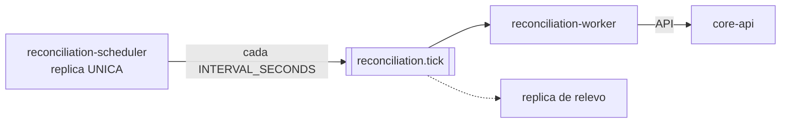
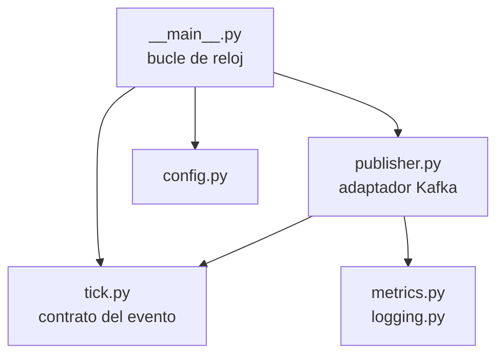

# Reconciliation Scheduler

El reloj de la conciliación. Publica un tick en Kafka cada `INTERVAL_SECONDS` y nada más.

**No consulta la API, no lee ninguna base y no toma ninguna decisión.** Es el proceso con menos
superficie del sistema: su entorno solo tiene `KAFKA_BROKERS` y un intervalo, así que aunque alguien
añadiera código por error, no tendría con qué llamar a nadie.

| | |
|---|---|
| Stack | Python 3.12 · aiokafka |
| Responsable | Sergio |
| Produce | `reconciliation.tick` |
| Almacenes | **Ninguno** |
| Réplicas | **Una sola** |
| Puerto | `8083` — solo `/metrics` |

**ADR asociado:** [ADR-0006 — El reloj va en un servicio aparte](../docs/adr/0006-scheduler-como-servicio-aparte.md)

## Por qué está separado del worker

El proceso que decide *cuándo* trabajar y el que *hace* el trabajo tienen requisitos opuestos: el
primero debe correr como réplica única, el segundo querría escalar. Con el bucle dentro del worker,
dos réplicas significaban dos relojes y trabajo duplicado.



Y por ser el único que debe correr como réplica única, es también el que **no puede hacer daño**: se
puede reiniciar, detener o desplegar en cualquier momento. Un ciclo perdido se recupera en el
siguiente y ningún pago empeora por esperar.

## El tick

```json
{
  "tick_id": "reconcile:1785000000",
  "fired_at": "2026-07-31T16:05:00Z",
  "interval_seconds": 300,
  "correlation_id": "44444444-4444-4444-4444-444444444444"
}
```

| Campo | Para qué |
|---|---|
| `tick_id` | Determinista por ventana de tiempo. Dos schedulers producen el mismo id y el worker deduplica |
| `fired_at` | El worker descarta los ticks que superan dos veces el intervalo |
| `interval_seconds` | El worker sabe cuánto vale un tick sin leer su propia configuración |
| `correlation_id` | Recorre el ciclo y acaba en el historial de cada pago cerrado |

Ese último campo importa más de lo que parece: un pago expirado queda en el historial con el mismo
`correlation_id` que el tick que lo cerró, así que se puede pedir *"todo lo que hizo el ciclo de las
16:05"* y obtener la lista completa.

**Un tick fallido no se reintenta.** El siguiente sale igual y cubre exactamente el mismo trabajo.

## Estructura

Es el servicio más pequeño del sistema y su estructura lo refleja: no tiene capa de aplicación
porque no hay ningún caso de uso que orquestar.



```
scheduler/
  tick.py          contrato del evento: forma, tick_id determinista
  publisher.py     adaptador Kafka
  __main__.py      el bucle de reloj
  config.py        entorno validado al arrancar
  metrics.py · logging.py
```

**`tick.py` es el contrato y va aparte del transporte.** El worker tiene su espejo en
[`worker/ticks.py`](../reconciliation-worker/worker/ticks.py); los dos lados se prueban por separado
y sin Kafka. Si el formato cambia, fallan las pruebas de ambos.

## Ejecución

```bash
docker compose up --build reconciliation-scheduler
```

Solo:

```bash
cd reconciliation-scheduler
python3 -m venv .venv && .venv/bin/pip install -e ".[dev]"
KAFKA_BROKERS=localhost:9092 .venv/bin/python -m scheduler
```

Para ver los ticks salir:

```bash
docker compose exec kafka /opt/kafka/bin/kafka-console-consumer.sh \
  --bootstrap-server localhost:29092 --topic reconciliation.tick --from-beginning
```

## Configuración

| Variable | Por defecto | Qué controla |
|---|---|---|
| `KAFKA_BROKERS` | `kafka:29092` | Único destino del proceso |
| `TICK_TOPIC` | `reconciliation.tick` | Contrato con el worker |
| `INTERVAL_SECONDS` | `300` | Cadencia del disparo |
| `METRICS_PORT` | `8083` | — |
| `LOG_LEVEL` | `INFO` | — |

No hay `CORE_API_URL` ni credenciales: **lo que este proceso puede hacer lo limita su configuración,
no su código**.

## Métricas

```
reconciliation_scheduler_ticks_total
reconciliation_scheduler_publish_failures_total{reason}
reconciliation_scheduler_last_tick_timestamp
```

`last_tick_timestamp` es la importante. Si deja de avanzar, nadie está disparando la conciliación y
**ninguna otra métrica lo diría**: el worker simplemente estaría inactivo, que se ve igual que "no
hay trabajo pendiente". La alerta natural es `time() - last_tick_timestamp > 2 × intervalo`.

## Pruebas

```bash
cd reconciliation-scheduler && .venv/bin/python -m pytest
```

5 pruebas sobre el contrato del tick: ventana determinista, cambio de ventana, división por cero,
forma del mensaje y unicidad de la correlación. Ninguna necesita Kafka.

## Qué puede salir mal

| Falla | Qué ocurre | Qué **no** ocurre |
|---|---|---|
| El scheduler está caído | Nadie dispara. `last_tick_timestamp` deja de avanzar y avisa | Pérdida de datos: los pagos siguen donde estaban |
| Kafka caído | El tick se pierde y se cuenta. El proceso sigue vivo | Que el scheduler muera o acumule ticks en memoria |
| Dos schedulers a la vez | El `tick_id` determinista hace que el worker descarte el duplicado | Trabajo doble sostenido |
| El worker está caído | Los ticks se acumulan en el topic. Al volver, descarta los viejos | Ejecutar decenas de ciclos redundantes de golpe |

**Limitación conocida.** La réplica única es una restricción operativa, no una garantía técnica. Si
alguien escala el servicio, los `tick_id` amortiguan pero no resuelven. Una elección de líder queda
evaluada y aplazada en [ADR-0006](../docs/adr/0006-scheduler-como-servicio-aparte.md).
