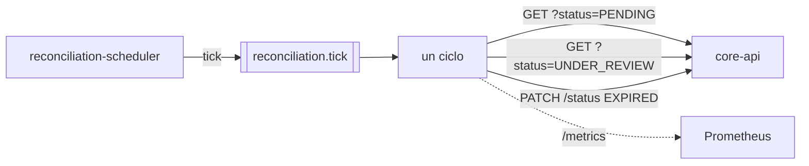
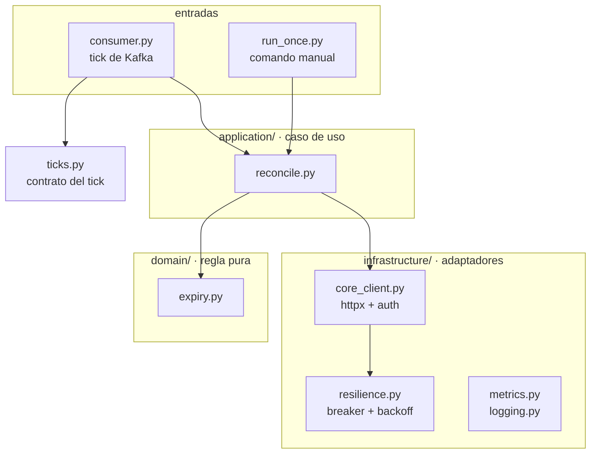

# Reconciliation Worker

Cierra los Payment Intents que se quedaron abiertos más allá de su ventana. Es lo que
[ADR-0003](../docs/adr/0003-politica-risk-service-caido.md) deja explícitamente de este lado:
un `UNDER_REVIEW` que nunca se resuelve porque el Risk Service no volvió.

**Nunca toca la base de datos.** Pide la transición por la API pública del core, de modo que el
cambio pasa por la máquina de estados, el historial con actor y las mismas validaciones que
cualquier otro cambio. Es el límite no negociable del reto.

| | |
|---|---|
| Stack | Python 3.12 · httpx · aiokafka |
| Responsable | Sergio |
| Consume | `reconciliation.tick` |
| Almacenes | **Ninguno** |
| Puerto | `8082` — solo `/metrics` |

**ADRs asociados:** [ADR-0003 — Estado seguro ante fallas del Risk Service](../docs/adr/0003-politica-risk-service-caido.md) ·
[ADR-0005 — Reintentos, timeouts y circuit breaker](../docs/adr/0005-reintentos-y-breaker-del-worker.md) ·
[ADR-0006 — El reloj va en un servicio aparte](../docs/adr/0006-scheduler-como-servicio-aparte.md)

> ## ⚠ Integración pendiente con `core-api`
>
> El worker necesita un endpoint que **hoy no existe**: `core-api` expone `POST`, `GET`, `List` e
> `History` de payment intents, pero no una forma de solicitar un cambio de estado.
>
> ```
> PATCH /api/v1/payment-intents/{payment_intent_id}/status
> Authorization: Bearer <jwt>
> X-Correlation-Id: <el del intent>
>
> { "status": "EXPIRED", "reason": "vencido sin resolverse dentro de la ventana" }
> ```
>
> | Respuesta | Cuándo | Qué hace el worker |
> |---|---|---|
> | `200` + intent | Transición aplicada | Cuenta `expired` |
> | `409` | Ya estaba en `EXPIRED` | Cuenta `already` — es éxito |
> | `422` | Transición inválida | Cuenta `rejected`, sigue con el siguiente |
> | `404` / `405` | **El endpoint no existe** | Corta el ciclo y lo reporta como integración pendiente |
>
> El worker está implementado y probado contra ese contrato; el código distingue el `404` de una
> caída a propósito ([`StatusEndpointMissing`](worker/infrastructure/core_client.py)), para que
> el día que el endpoint aparezca funcione sin tocar nada. **Queda pendiente de Valentina**, dueña
> de `core-api`.

## Cómo encaja



**El reloj no vive aquí.** Este proceso solo reacciona al tick que publica
[`reconciliation-scheduler`](../reconciliation-scheduler/README.md), lo que le permite escalar sin
duplicar disparos ([ADR-0006](../docs/adr/0006-scheduler-como-servicio-aparte.md)).

Antes de ejecutar un ciclo descarta dos clases de tick:

- **Viejos** — más de dos veces el intervalo. Un worker que vuelve tras estar caído encuentra los
  acumulados; procesarlos todos repetiría el mismo ciclo N veces justo cuando el sistema acaba de
  recuperarse. El último cubre el mismo trabajo, porque la consulta pregunta por el estado actual.
- **Repetidos** — mismo `tick_id`, que ocurre si hubo dos schedulers durante un despliegue.

**Consulta la API y no una proyección propia.** Mantener una copia local de los intents abiertos
sería más barato, pero sería una segunda interpretación de los datos del core, siempre unos
milisegundos por detrás, y el worker acabaría intentando cerrar pagos que ya cambiaron.

## Estructura



```
worker/
  domain/          expiry.py                  qué vence: función sobre fechas, sin IO
  application/     reconcile.py               el ciclo completo
  infrastructure/  core_client.py             HTTP con timeouts, reintentos y breaker
                   resilience.py              circuit breaker + backoff con jitter
                   metrics.py · logging.py
  ticks.py                                    contrato del tick del scheduler
  consumer.py                                 entrada: escucha Kafka
  run_once.py                                 entrada: un ciclo y termina
  config.py                                   entorno validado al arrancar
```

**Dos entradas, un solo caso de uso.** `consumer.py` reacciona al tick y `run_once.py` es el comando
que pide el anexo de Python; los dos llaman a `ReconcileExpired`. La lógica no se duplica, así que el
comando manual demuestra exactamente lo que hace el proceso.

**`resilience.py` está separado de `core_client.py`** a propósito: el breaker y el backoff no saben
nada de HTTP y se prueban con un reloj falso, sin red.

**`domain/expiry.py` no importa `httpx` ni el cliente de Kafka.** La regla de negocio —qué está
vencido— se prueba con fechas fijas en milisegundos.

## Qué se considera vencido

| Estado | ¿Se expira? | Por qué |
|---|---|---|
| `PENDING` | Sí | Se creó pero nunca llegó a evaluarse |
| `UNDER_REVIEW` | Sí | El Risk Service no respondió nunca (ADR-0003) |
| `APPROVED` · `REJECTED` · `CANCELLED` · `EXPIRED` | No | Son terminales: pedirlo daría `422` y sería ruido |

Los dos primeros son exactamente los estados desde los que la tabla de transiciones del core permite
salir a `EXPIRED`. El worker no inventa su propia idea de qué es legal: la copia de
`core-api/internal/domain/payment_intent.go`.

**La ventana la define el core, no el worker.** Se usa el `expires_at` que el core puso al crear el
intent. Si los dos tuvieran su propia noción de cuándo vence un pago, tarde o temprano discreparían.

## Ejecución

Un ciclo y termina — es el comando que pide el anexo de Python:

```bash
python -m worker.run_once
```

```
Conciliacion terminada: encontrados=3 expirados=3 ya_estaban=0 rechazados=0 fallidos=0
```

Sale con código `2` si el endpoint de transición todavía no existe, para que sirva en un cron o en
CI sin dar un falso verde.

Como proceso de larga duración, escuchando el tick:

```bash
docker compose up --build reconciliation-scheduler reconciliation-worker
```

El ciclo es síncrono y puede tardar minutos, así que se lanza en un hilo aparte: bloquear el bucle
de eventos provocaría justo el rebalanceo de Kafka que `max_poll_interval_ms` intenta evitar.

### Demostrarlo sin esperar media hora

`EXPIRY_OVERRIDE_MINUTES` cierra por antigüedad en vez de respetar el `expires_at` del core. Es una
palanca de demo y nada más; vacía en operación normal.

```bash
EXPIRY_OVERRIDE_MINUTES=1 python -m worker.run_once
```

## Resiliencia

Regla: **se reintenta la infraestructura, nunca el dominio.**

| Situación | ¿Reintentar? |
|---|---|
| Timeout, conexión rechazada, `429`, `5xx` | Sí, hasta `MAX_RETRIES` |
| `401` | Sí, una vez: renueva el token y repite |
| `422 INVALID_TRANSITION` | **No.** Daría `422` las tres veces |
| `409` | **No.** Ya está donde queríamos |
| `404` en el endpoint de status | **No.** Es una integración pendiente |

**Solo esta capa reintenta en toda la cadena.** El worker es el origen del trabajo; si el core
reintentara también, un fallo produciría nueve llamadas en vez de tres. Hay una prueba que lo
afirma ([`test_no_reintenta_indefinidamente`](tests/test_core_client.py)).

Backoff exponencial con **jitter completo** — `random(0, min(tope, base × 2^intento))` — para que
varias réplicas no reintenten sincronizadas y tumben el core justo cuando se está recuperando.

**Circuit breaker por dependencia.** Su valor no es dejar de llamar, sino fallar rápido hacia el
estado seguro: con el core caído y el breaker cerrado, cada intent gasta su timeout completo antes
de rendirse; con el breaker abierto, el ciclo termina de inmediato y el siguiente disparo lo
reintenta. Razonamiento completo en
[ADR-0005](../docs/adr/0005-reintentos-y-breaker-del-worker.md).

**Si un ciclo se pierde entero, no pasa nada.** Un pago vencido no empeora por esperar y el
siguiente ciclo lo recupera. Por eso el ciclo no reintenta a nivel de ciclo: se rinde y se va.

## Configuración

| Variable | Por defecto | Qué controla |
|---|---|---|
| `CORE_API_URL` | `http://core-api:8080` | — |
| `CORE_USERNAME` / `CORE_PASSWORD` | — | Credencial de servicio para `POST /auth/login` |
| `KAFKA_BROKERS` | `kafka:29092` | Para consumir el tick |
| `TICK_TOPIC` | `reconciliation.tick` | Contrato con el scheduler |
| `KAFKA_GROUP_ID` | `reconciliation-worker` | Compartido: varias réplicas se reparten los ticks |
| `MAX_POLL_INTERVAL_MS` | `600000` | Debe superar el ciclo más largo |
| `EXPIRY_OVERRIDE_MINUTES` | *(vacío)* | Solo demo. Cierra por antigüedad |
| `PAGE_SIZE` | `100` | Tamaño de lote por estado |
| `REQUEST_TIMEOUT_SECONDS` | `2.0` | Por petición |
| `MAX_RETRIES` | `3` | Con backoff y jitter |
| `BREAKER_FAILURE_THRESHOLD` | `10` | Fallos seguidos que abren el circuito |
| `BREAKER_RESET_SECONDS` | `60` | Antes de dejar pasar una sonda |
| `METRICS_PORT` | `8082` | — |
| `LOG_LEVEL` | `INFO` | — |

## Métricas

```
reconciliation_cycle_duration_seconds
reconciliation_intents_found_total
reconciliation_intents_resolved_total{outcome}   expired | already | rejected | failed
reconciliation_cycle_failures_total{reason}      core_unavailable | status_endpoint_missing
reconciliation_retry_attempts_total{outcome}
reconciliation_circuit_breaker_state             0 cerrado · 1 semiabierto · 2 abierto
reconciliation_ticks_discarded_total{reason}     stale | duplicate | malformed
reconciliation_consumer_up
reconciliation_last_cycle_timestamp
```

`reconciliation_last_cycle_timestamp` es la que detecta un worker muerto: si deja de avanzar, nadie
está conciliando y ninguna otra métrica lo diría, porque el proceso simplemente estaría inactivo.

## Pruebas

```bash
cd reconciliation-worker && .venv/bin/python -m pytest
```

34 pruebas, ninguna necesita levantar el core: el cliente se prueba con `respx` contra las rutas y
los cuerpos reales del contrato.

| Archivo | Qué cubre |
|---|---|
| `test_expiry.py` | Qué vence y qué no, con reloj fijo. Formato de fecha del core |
| `test_resilience.py` | Estados del breaker, la sonda que vuelve a abrir, jitter |
| `test_core_client.py` | Reintentos, renovación de token, `409`/`422`/`404`, fallo rápido, `correlation_id` |
| `test_reconcile.py` | El ciclo completo con un core simulado |
| `test_ticks.py` | El contrato del tick, el descarte por antigüedad y el umbral exacto |

## Qué puede salir mal

| Falla | Qué ocurre | Qué **no** ocurre |
|---|---|---|
| El core no responde | El ciclo se pierde entero; el siguiente lo recupera | Pérdida de datos |
| El token caducó | Se renueva una vez y se reintenta | Que el ciclo falle por eso |
| Alguien resolvió el intent entre el `GET` y el `PATCH` | `422`, se registra y se sigue | Revertir una decisión legítima |
| Dos réplicas toman el mismo intent | La segunda recibe `409` y lo cuenta como éxito | Doble entrada en el historial |
| El endpoint de status no existe | Corta el ciclo, sale con código `2` | Repetir el mismo `404` por cada intent |
| El breaker está abierto | El ciclo termina sin gastar timeouts | Golpear a un core que ya se sabe caído |
| El scheduler está caído | No llegan ticks y no corre nada. Lo delata `reconciliation_scheduler_last_tick_timestamp` | Que el worker muera |
| El worker vuelve tras una caída | Descarta los ticks viejos y ejecuta uno | Encadenar decenas de ciclos redundantes |
