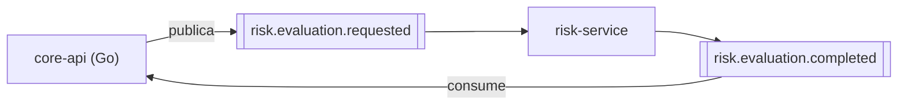
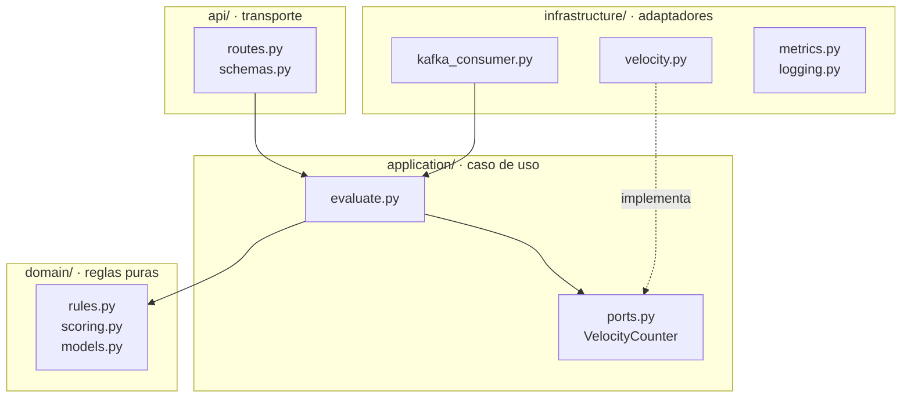

# Risk Service

Decide si un Payment Intent se aprueba, se manda a revisión o se rechaza. Reglas determinísticas y
explicables, sin aprendizaje automático.

**No tiene base de datos, ni caché, ni estado persistente.** Todo lo que necesita para decidir llega
en el evento o lo deriva del propio flujo que consume.

| | |
|---|---|
| Stack | Python 3.12 · FastAPI · aiokafka |
| Responsable | Sergio |
| Consume | `risk.evaluation.requested` |
| Produce | `risk.evaluation.completed` |
| Puerto | `8081` — solo salud, métricas y evaluación de prueba |

**ADRs asociados:** [ADR-0001 — Contrato Go/Python vía Kafka](../docs/adr/0001-contrato-go-python.md) ·
[ADR-0003 — Estado seguro ante fallas del Risk Service](../docs/adr/0003-politica-risk-service-caido.md) ·
[ADR-0004 — Velocidad sin acceso a la base](../docs/adr/0004-velocidad-sin-acceso-a-la-base.md)

El contrato con `core-api` está en [ADR-0001](../docs/adr/0001-contrato-go-python.md). Este servicio
lo implementa tal cual: si el payload cambia, se rompe la integración con Go, así que hay una prueba
que valida contra el payload literal del ADR ([`tests/test_kafka_contract.py`](tests/test_kafka_contract.py)).

## Cómo encaja



No conoce a `core-api`, no lo llama y no puede alcanzarlo. Recibe un evento con todo lo que necesita
y publica otro. Es la forma más fuerte del límite del reto: no es que no deba tocar las tablas de
pagos, es que **no tiene credenciales de ninguna base**.

## Las reglas

Se evalúan en orden de severidad y la primera que dispara manda: un comercio bloqueado se rechaza
aunque todo lo demás esté limpio, y una referencia sospechosa se rechaza aunque el monto sea bajo.

| Orden | Condición | Decisión | `reason_code` |
|---|---|---|---|
| 1 | `merchant_status` es `INACTIVE` | `REJECT` | `MERCHANT_BLOCKED` |
| 2 | Referencia vacía o con prefijo sospechoso | `REJECT` | `SUSPICIOUS_REFERENCE` |
| 3 | Intents recientes del comercio sobre el umbral | `REJECT` | `ABNORMAL_VELOCITY` |
| 4 | `amount_minor` sobre el umbral de revisión | `REVIEW` | `AMOUNT_ABOVE_REVIEW_THRESHOLD` |
| 5 | Ninguna de las anteriores | `APPROVE` | `LOW_RISK` |

**Un estado ausente o desconocido no bloquea.** `merchant_status` es un campo opcional del evento:
si `core-api` no lo manda, o manda un valor que este servicio no conoce, se decide sin esa regla.
Rechazar por no saber convertiría cualquier despliegue desalineado en una caída de las aprobaciones.

`model_version` (`rules-v2`) viaja en cada respuesta y `core-api` la persiste: si mañana cambian los
umbrales, se puede saber con qué versión se decidió cada pago histórico. `v2` añadió la regla de
comercio bloqueado — sube porque el mismo pago puede decidirse distinto que con `v1`, y sin eso un
`REJECT` viejo y uno nuevo serían indistinguibles al auditar.

### El score

No es un modelo: es una suma acotada a `[0, 100]` que se puede explicar en voz alta.

```
  5   de base
+ hasta 20 graduales por monto, proporcionales al umbral de revisión
+ 55  si el monto supera el umbral
+ 95  si disparó una regla bloqueante
+ 100 si el comercio está bloqueado
```

El comercio bloqueado satura el score a propósito: no es una sospecha que este servicio infiera, es
un hecho que reporta `core-api`.

El componente gradual existe para que el score **discrimine dentro de una misma decisión**: dos
pagos aprobados de 1.000 y de 90.000 COP no deberían tener el mismo número.

### La velocidad, sin tocar la base del core

La regla de velocidad necesita saber cuántos intents recientes tiene el comercio. Hay dos fuentes
posibles y **manda la de `core-api`**:

| Fuente | Cuándo se usa | Por qué |
|---|---|---|
| `merchant_recent_intents` del evento | Siempre que venga | La calcula el core sobre su tabla: exacta con varias réplicas y sobrevive a reinicios |
| Ventana deslizante propia, en memoria | Si el campo no viene | El campo es opcional; un `core-api` anterior no lo manda y hay que seguir decidiendo |

Las dos usan la misma semántica —no cuentan el intent que se está evaluando—, así que el umbral
significa lo mismo con cualquiera de ellas.

**La ventana propia se sigue alimentando aunque mande el core**, para que el respaldo esté caliente
si el campo deja de llegar y no arranque de cero justo cuando hace falta. El razonamiento completo
está en [ADR-0004](../docs/adr/0004-velocidad-sin-acceso-a-la-base.md).

Dos detalles de la ventana propia que importan:

- **`record` es idempotente por `payment_intent_id`.** Kafka entrega al menos una vez; sin esto, una
  reentrega inflaría el contador e inventaría un rechazo por velocidad.
- **El intent que se está evaluando no se cuenta a sí mismo.** Si lo hiciera, el primer pago de un
  comercio ya arrancaría con velocidad 1 y el umbral se correría en uno.

`risk_velocity_source_total{source}` dice cuál se usó. Si `local` deja de ser residual, el core dejó
de mandar el campo y estaríamos decidiendo con una cuenta por instancia **sin que ninguna otra señal
lo delate**.

## Estructura



```
app/
  domain/          rules · scoring · models      sin IO, sin reloj, sin framework
  application/     evaluate · ports              orquesta dominio + puertos
  infrastructure/  kafka_consumer · velocity     adaptadores concretos
                   metrics · logging
  api/             routes · schemas              FastAPI: salud, métricas, evaluación
  config.py                                      entorno validado al arrancar
  main.py                                        composición y arranque
```

**Dos transportes, un solo caso de uso.** El consumidor de Kafka y el endpoint HTTP llaman a
`EvaluateRisk`; ninguno tiene lógica propia. Por eso el endpoint de prueba no puede divergir del
camino de producción.

**`domain/` no importa nada de las otras tres capas.** Es lo que hace que `rules.py` se pruebe con
una tabla de casos y sin levantar nada.

**La velocidad entra por un puerto**, no por una llamada directa: el dominio recibe un número y no
sabe si vino de una ventana en memoria, del evento o de una base. Cambiar la fuente es cambiar el
adaptador ([ADR-0004](../docs/adr/0004-velocidad-sin-acceso-a-la-base.md)).

## Ejecución

Con el resto del sistema:

```bash
docker compose up --build risk-service
```

Solo, sin Kafka, para probar las reglas:

```bash
cd risk-service
python3 -m venv .venv && .venv/bin/pip install -e ".[dev]"
KAFKA_ENABLED=false .venv/bin/uvicorn app.main:app --port 8081
```

```bash
curl -s localhost:8081/api/v1/risk-evaluations -H 'content-type: application/json' -d '{"payment_intent_id":"a","merchant_id":"b","external_reference":"ORDER-1","amount_minor":150000,"currency":"COP","channel":"QR"}'
```

El endpoint HTTP existe **para probar y demostrar las reglas sin levantar Kafka**. El camino de
producción es el topic; los dos invocan el mismo caso de uso.

## Endpoints

| Método | Ruta | Para qué |
|---|---|---|
| `GET` | `/health` | Vive el proceso. No toca dependencias |
| `GET` | `/readiness` | Con Kafka activo, exige estar conectado al broker |
| `GET` | `/metrics` | Formato Prometheus |
| `POST` | `/api/v1/risk-evaluations` | Evaluación síncrona, para pruebas y demo |

`/readiness` se distingue de `/health` a propósito: un consumidor arriba pero sin broker está vivo y
no sirve para nada.

## Configuración

| Variable | Por defecto | Qué controla |
|---|---|---|
| `KAFKA_BROKERS` | `kafka:29092` | — |
| `KAFKA_ENABLED` | `true` | En `false` solo levanta el endpoint HTTP |
| `KAFKA_REQUESTED_TOPIC` | `risk.evaluation.requested` | Contrato con `core-api` |
| `KAFKA_COMPLETED_TOPIC` | `risk.evaluation.completed` | Contrato con `core-api` |
| `KAFKA_GROUP_ID` | `risk-service` | Grupo **compartido**: cada evento lo evalúa una réplica |
| `REVIEW_AMOUNT_MINOR` | `10000000` | 100.000 COP |
| `VELOCITY_MAX_RECENT` | `10` | Intents que disparan `ABNORMAL_VELOCITY` |
| `VELOCITY_WINDOW_SECONDS` | `60` | Ventana de la cuenta |
| `SUSPICIOUS_REFERENCE_PREFIXES` | `TEST-,FRAUD-` | Separados por coma |
| `LOG_LEVEL` | `INFO` | — |

La configuración se valida al arrancar: si falta algo obligatorio el proceso no levanta, en vez de
fallar en la primera petición.

## Métricas

```
risk_evaluations_total{decision,reason_code}
risk_evaluation_duration_seconds
risk_events_consumed_total{outcome}     processed | malformed
risk_events_published_total{outcome}    ok | error
risk_velocity_tracked_merchants
risk_consumer_up
```

Ninguna etiqueta lleva `merchant_id` ni `payment_intent_id`: son de cardinalidad no acotada y
convertirían cada comercio en una serie nueva de Prometheus.

## Pruebas

```bash
cd risk-service && .venv/bin/python -m pytest
```

35 pruebas, ninguna necesita red ni contenedores. Las reglas son una función pura, así que se prueban
con una tabla de casos — esa es la ventaja concreta de haberlas diseñado sin estado.

| Archivo | Qué cubre |
|---|---|
| `test_rules.py` | Cada regla, la precedencia por severidad, determinismo, score acotado |
| `test_scoring.py` | Que el score discrimine dentro de una misma decisión |
| `test_velocity.py` | Ventana, olvido, idempotencia ante reentrega, memoria acotada |
| `test_evaluate_use_case.py` | Que el intent no se cuente a sí mismo, velocidad por comercio |
| `test_kafka_contract.py` | El payload **literal** del ADR-0001 |
| `test_api.py` | Salud, readiness, métricas y validación del borde |

## Qué puede salir mal

| Falla | Qué ocurre | Qué **no** ocurre |
|---|---|---|
| El servicio está caído | Los eventos esperan en el topic; los intents siguen en `UNDER_REVIEW` | Aprobación silenciosa |
| Procesa con retraso | Sube el lag del consumidor; el intent se resuelve cuando llegue | Pérdida de solicitudes |
| Recibe el mismo evento dos veces | Produce la misma decisión: las reglas son puras | Doble transición, ni velocidad inflada |
| Evento malformado | Se cuenta, se loguea y se descarta | Que bloquee la partición para los demás |
| Kafka caído | `/readiness` responde `503` | Decisiones inventadas |

## Limitaciones conocidas

- **La regla de comercio bloqueado no se implementa.** El evento no trae `merchant_status` y
  `core-api` no expone comercios todavía. Está propuesta en
  [ADR-0004](../docs/adr/0004-velocidad-sin-acceso-a-la-base.md) como campo opcional a añadir al
  contrato; hasta entonces la regla no se puede evaluar.
- **La ventana de velocidad es por instancia y se pierde al reiniciar.** Con una sola réplica, que es
  como corre hoy, es exacta. Con varias, cada una vería solo su fracción del tráfico.
- **No hay deduplicación por `event_id`** porque el evento del contrato no lo lleva. Reprocesar es
  inofensivo (las reglas son puras) y el contador de velocidad ya es idempotente por intent.
